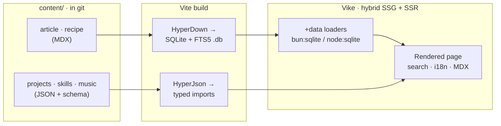

# Building This Portfolio

**No backend. No database service. No CMS bill.** This site runs a fully searchable,
bilingual, content-rich experience from a SQLite file generated at build time and shipped
inside the bundle. There is nothing to keep awake, nothing to scale, and nothing to pay for
beyond static-ish hosting — and yet it behaves like it has a server.

That cuts two ways. For a **business**, it means a
content-rich marketing-and-portfolio site with the running cost of a static page, no vendor
lock-in, and content that lives in git instead of someone else's dashboard. For an **engineer**,
it means real full-text search, faceted filtering, and i18n with no API to operate. This post is
the tour: a feature-by-feature walk through the site, and the story of the piece I had to build to
make it possible.

<br />

The catch: this architecture did not exist off the shelf. To get a database
that ships in the build, I had to write the engines that produce it. That toolkit is **Indago**,
and it is now open source. This article explains the _portfolio_; the companion piece,
[Getting Started with Indago](/articles/getting-started-with-indago), explains the _engines_ — what
they are and how they work under the hood. I will link into its sections as they come up, rather
than repeat them here.

<nav className="article-toc" aria-label="Contents">

- [Building This Portfolio](#building-this-portfolio)
  - [The big idea: a database that ships in the build](#the-big-idea-a-database-that-ships-in-the-build)
  - [The stack at a glance](#the-stack-at-a-glance)
  - [Routing and bilingual i18n](#routing-and-bilingual-i18n)
  - [Two content engines, one content folder](#two-content-engines-one-content-folder)
  - [Structured content with HyperJson](#structured-content-with-hyperjson)
  - [Prose and recipes with HyperDown](#prose-and-recipes-with-hyperdown)
  - [The Articles experience](#the-articles-experience)
  - [Reading aids: TOC minimap and hash scroll](#reading-aids-toc-minimap-and-hash-scroll)
  - [Series navigation and suggested content](#series-navigation-and-suggested-content)
  - [Cooking, Photography, Music, and Links](#cooking-photography-music-and-links)
  - [The MDX rendering pipeline](#the-mdx-rendering-pipeline)
  - [SEO, Open Graph, and the sitemap](#seo-open-graph-and-the-sitemap)
  - [Prerender strategy: what is static, what is live](#prerender-strategy-what-is-static-what-is-live)
  - [Deploy: Vercel and Docker](#deploy-vercel-and-docker)
  - [Quality gates](#quality-gates)
  - [What I would tell you to steal](#what-i-would-tell-you-to-steal)

</nav>

## The big idea: a database that ships in the build

The central trick is this: **content lives as plain files in the repo** —
Markdown/MDX for prose, JSON for structured data — and the **build compiles those
files into a SQLite database and a set of typed modules**. At runtime, server
loaders query that SQLite file directly with `bun:sqlite` (or `node:sqlite` on
Node 22+, which is what Vercel runs). Nothing is fetched from an external service.

Why a database at all, instead of just importing JSON? Because the articles and
recipes need **full-text search**, faceted filtering, sorting, and pagination — and
doing that over an in-memory array does not stay fast as content grows. SQLite's
**FTS5** gives me a real inverted index, and because the index is _contentless_, the
database stays small: it stores the searchable tokens and the frontmatter metadata,
but **never the article body**. (That storage model is the deep dive of the engine
post — see
[the contentless inverted index](/articles/getting-started-with-indago#how-it-works-the-contentless-inverted-index).)

The result is a site that feels like it has a backend — live search that responds
to every keystroke server-side — with the operational profile, and the bill, of a
static site.



## The stack at a glance

| Layer           | Choice                                                            |
| --------------- | ----------------------------------------------------------------- |
| Framework       | **Vike** (`vike` + `vike-react` + `vike-server`) — hybrid SSG/SSR |
| UI              | **React 19**                                                      |
| Server          | **Hono** via `@vikejs/hono`                                       |
| Runtime         | **Bun** in dev/Docker; **Node 22** on Vercel                      |
| Styling         | **Tailwind CSS v4** + shadcn-style components + lucide icons      |
| Prose content   | **`@indago/hyper-down`** — MDX → SQLite FTS5 (SSR-only)           |
| Structured data | **`@indago/hyper-json`** — JSON Schema → typed imports            |
| i18n            | `i18next` + `react-i18next`, locale-stripping routing             |
| Lint / format   | **OXC** (`oxlint` + `oxfmt`) — not ESLint, not Biome              |
| Tests           | **Vitest** (unit + content-integrity) and **Playwright** (e2e)    |
| Deploy          | **Vercel** (Build Output API) or **Docker** (self-hosted SSR)     |

Two things on that list are mine: the content engines. Everything else is
off-the-shelf, wired together deliberately.

## Routing and bilingual i18n

The site is fully bilingual — English and Brazilian Portuguese — and the i18n
strategy is **locale-stripping**. The default locale (`en`) is prefix-free, so the
homepage is `/`, the articles live at `/articles`, and so on. Portuguese lives
under `/pt`: `/pt/articles`, `/pt/cooking`, etc.

A Vike `+onBeforeRoute` hook strips the `/pt` prefix before routing, sets
`pageContext.locale`, and computes a `urlLogical` that the rest of the app routes
against. The subtle part — and the source of a bug I only caught with an e2e test —
is that `urlLogical` **must keep the query string and hash**. Vike re-parses the
URL from that logical value, so a pathname-only version silently empties every
search-driven loader. The fix is to build it as
`pathnameWithoutLocale + search + hash`.

```ts
// +onBeforeRoute.ts (essence)
const { urlWithoutLocale, locale } = extractLocale(pageContext.urlParsed);
return {
  pageContext: {
    locale,
    // search + hash are load-bearing — without them, ?q=… disappears
    urlLogical: urlWithoutLocale + searchOriginal + hashOriginal,
  },
};
```

There is a matching detail on the client: the search-params navigation helper has
to build its target from `window.location.pathname` (which _is_ locale-prefixed),
not from the locale-stripped `pageContext.urlPathname` — otherwise a `/pt` visitor
gets bounced back to the English version on the first filter click.

## Two content engines, one content folder

All content lives under `content/`, split by type, then by locale:

```text
content/
├── article/                 HyperDown (MDX)
│   ├── en/*.mdx
│   └── pt-BR/*.mdx
├── recipe/                  HyperDown (MDX)
│   ├── en/*.mdx
│   └── pt-BR/*.mdx
├── projects/                HyperJson (JSON + schema)
│   ├── schema.json
│   └── en/projects.json
├── profile/  skills/  education/  languages/
├── music/    photography/
```

The split is by the _shape_ of the content. **HyperJson** owns structured data —
anything that is a list of records with a fixed shape (projects, skills, playlists,
photo albums). **HyperDown** owns prose — anything with a body you want to read and
search (articles, recipes). They share no code and no dependency; the only thing
they share is the `content/` directory and the locale-subfolder convention. The
engine post covers
[why two engines](/articles/getting-started-with-indago#hyperdown-or-hyperjson) in
full; here I will only show how the _site_ uses each.

## Structured content with HyperJson

A HyperJson content type is a folder with a `schema.json` and per-locale data files.
At build time every data file is validated against its schema — an unknown key or a
wrong type **fails the build** — and TypeScript types are generated from the schema,
so every import is fully typed:

```ts
// Fully typed — the type is generated from projects/schema.json
import projects from "@content/projects/en/projects.json";
```

That single guarantee — _invalid content cannot ship, and valid content arrives
typed_ — is what powers the entire static half of the site: the About section, the
Projects and Skills grids, the Education and Languages blocks, the Music playlists,
and the Photography albums all read straight from typed JSON. On top of the typed
imports, HyperJson ships **headless hooks** (`useFilter`, `useSearch`, `useSort`,
`usePaginate`, and a `useComposed` that chains all four) for shaping that data in
React — the Music page uses them to filter playlists by genre and search by
title/artist entirely on the client, with zero UI imposed.

## Prose and recipes with HyperDown

HyperDown takes the opposite path: it compiles every Markdown/MDX file into a SQLite
database with a contentless FTS5 index, queried only on the server. For the site,
the important surface is the generated, typed, server-only repository each content
type gets:

```ts
// articles/+data.ts — runs only on the server (SSR/SSG)
const { results, totalCount, totalPages } = await articleRepository.search({
  locale,
  searchQuery, // FTS5 across all locales
  filters: activeTag ? { tag: activeTag } : {},
  sort: { sortBy: "date", sortDir: "desc" },
  pagination: { page, pageSize: 9 },
});
```

Content types are declared once in `frontmatter.json` (the FrontMatter CMS format,
so the site is editable from VS Code's FrontMatter panel), which is the single
source of truth for both the SQLite schema and the generated TypeScript types. Two
optional fields I added there — `prev` and `next` — drive the article series, and a
`related()` method drives suggested content; both come up below. The mechanics of
how that body never reaches storage, and how the FTS index is tuned to stay small,
are the heart of the engine post — see
[the request lifecycle](/articles/getting-started-with-indago#the-request-lifecycle)
and the index deep dive there. What matters for the site is the payoff in the next
section.

## The Articles experience

The articles list is the showcase of the whole architecture, because it is **live
server-side search**. The listing page sets `prerender: false`, so under the Hono
server every URL change re-runs the loader on the server and returns a freshly
queried page. The entire state lives in the URL — `q`, `tag`, `page`, `sort`,
`dir` — which means every result set is shareable and bookmarkable, and the back
button just works.

Features on the listing:

- **Full-text search** over titles, descriptions, and article bodies, with prefix
  matching (typing `hyper` matches `HyperDown`). The query is debounced on the
  client and pushed into the URL; the server does the actual FTS.
- **Tag facets** built from the real distribution of tags in the database
  (`distinctValues`, ordered by frequency), with a "show more" affordance.
- **Sorting** by date or title, ascending or descending.
- **Pagination** with an accurate total count computed in the same query.

The detail page (`/articles/@slug`) is the opposite — fully **prerendered to
static HTML**. Every slug is enumerated at build time and rendered, including its
`/pt` twin. It shows the cover, the meta bar (author, date, reading time, a
canonical link if the piece was published elsewhere), the rendered MDX body, and
the tag chips that link back into the filtered list.

## Reading aids: TOC minimap and hash scroll

Long technical posts need navigation, so the detail page has two reading aids that
took more care than they look.

The **PageMinimap** renders a clickable, scaled-down mirror of the article on the
side — a table-of-contents you can see the shape of. The catch: it is a literal
clone of the article DOM, so it would duplicate every heading `id`. Hash
navigation would then jump to the _mirror_ copy. The fix is to strip every
descendant `id` from the clone, leaving the ids unique to the real article.

The **hash scroll** behavior handles `#section` links in the TOC. Vike intercepts
`<a href="#…">` clicks via `pushState`, so a normal handler never sees them. The
workaround is a **capture-phase** click listener that catches TOC clicks before
Vike does and scrolls smoothly to the target.

Both behaviors are covered by Playwright specs, precisely because they are the kind
of thing that breaks silently on a framework upgrade.

## Series navigation and suggested content

Two features turn a pile of articles into a guided reading experience.

**Series navigation** turns related articles into an explicit, ordered reading
path — a doubly-linked list expressed entirely in frontmatter. Each article can
declare an optional `prev` and `next` slug:

```yaml
# building-this-portfolio.mdx
next: "getting-started-with-indago"

# getting-started-with-indago.mdx
prev: "building-this-portfolio"
```

The detail loader resolves those slugs to their metadata and renders a previous/
next pager at the foot of the article. It is entirely opt-in: an article with no
`prev`/`next` (like my SOM deep dive) simply shows no pager.

**Suggested content** is the automatic counterpart. At the bottom of every article
and recipe, the site shows up to three related items — and the ranking is done **by
tag order**. The current item's tags are treated as a priority list: candidates
sharing the _first_ tag fill the slots first, then the second tag complements up to
three, and so on. I added this as a first-class `related()` method to HyperDown so
it runs as a single indexed SQL query against the tags bridge, ranked with a
`MIN(CASE …)` over the matched tag positions:

```ts
const suggestions = await articleRepository.related({
  slug,
  tags: article.tags, // priority order
  locale,
  limit: 3,
});
```

Because the ranking keys off the article you are reading, the suggestions stay
genuinely relevant instead of being a generic "latest posts" strip.

## Cooking, Photography, Music, and Links

The same machinery powers the rest of the site, which is the point — once the
engines exist, every section is cheap.

- **Cooking** mirrors Articles but for recipes: the listing has facets for cuisine,
  meal type, and course type (each a real column in SQLite), plus search and
  pagination. Recipe detail pages render the MDX method and ingredient lists, and
  they get the same tag-ranked suggested-content strip at the bottom.
- **Photography** reads albums from typed JSON (HyperJson) and lays them out as a
  gallery; images live in `public/photos`.
- **Music** is the best showcase of the headless hooks — playlists and favorites
  from JSON, filtered by genre and searched live on the client with `useComposed`.
- **Links** is a compact linktree-style page for social and contact links, also
  driven by content rather than hardcoded markup.

## The MDX rendering pipeline

Article and recipe bodies are real MDX, so they can contain JSX, and the render
pipeline is tuned for technical writing. The `MdxRender` component (from HyperDown)
renders the lazily-loaded body with a Suspense fallback, and the plugin chain adds:

- **`rehype-highlight`** (highlight.js) for syntax-highlighted code blocks —
  loaded only on pages that actually render MDX, to keep it off every other page's
  critical path.
- **`rehype-katex`** + **`remark-math`** for LaTeX math, so I can write
  `argmin`/`Σ`/integrals in the SOM post.
- **`remark-gfm`** for tables, task lists, and strikethrough.
- **mermaid** for inline diagrams (the flowcharts and sequence diagrams in these
  posts) rendered from fenced code blocks.

The CSS for code and math (`github-dark` and `katex.min.css`) is imported at the
detail-page level rather than globally, so the homepage never pays for it.

## SEO, Open Graph, and the sitemap

Because the detail pages are prerendered, they are fully crawlable static HTML with
real metadata. Each article emits its own Open Graph and Twitter card tags —
`og:title`, `og:description`, `og:image` (the cover), `article:published_time`, and
one `article:tag` per tag — on top of the locale-aware canonical and `hreflang`
links from the root head.

The **sitemap** is generated at build time by HyperDown's sitemap plugin from a
declarative block in `hyperdown.config.json`: static routes with their priorities,
plus one entry per content item across both locales. It writes straight to
`public/sitemap.xml`, so search engines get an accurate map every build without me
maintaining it by hand.

## Prerender strategy: what is static, what is live

The hybrid SSG/SSR split is deliberate and per-route:

| Route                               | Mode                          | Why                                        |
| ----------------------------------- | ----------------------------- | ------------------------------------------ |
| `/`, sections                       | Prerendered (SSG)             | Content is static; ship pure HTML.         |
| `/articles`, `/cooking` listings    | Live SSR (`prerender: false`) | Search/filter must run per request.        |
| `/articles/@slug`, `/cooking/@slug` | Prerendered (SSG)             | Every slug is known at build; render once. |

Globally the app runs with `prerender: { partial: true }`, so most of the site is
static HTML, while the two listing routes opt back into SSR. Keeping the listings
as SSR is also what keeps a real server bundle in the output, which the Hono
adapter then serves.

## Deploy: Vercel and Docker

The same build targets two very different homes.

On **Vercel**, a plugin (`vite-plugin-vercel`, enabled only when Vercel sets
`VERCEL=1`) rewrites the build into the **Build Output API** layout under
`.vercel/output/`. The SSR functions run on Node 22, which is exactly why the
SQLite client is written to fall back from `bun:sqlite` to `node:sqlite` — same
code, two runtimes. The generated `.db` files are copied into the function bundle
so the loaders can read them at the edge of the request.

For **self-hosting**, a plain build produces a runnable Hono SSR server, and the
included `Dockerfile` / `docker-compose.yml` package it so `bun run start` serves
the whole thing from one container. No external database, because the database is
already inside the image.

## Quality gates

Nothing ships without passing four gates, in order:

1. **`oxlint` + `oxfmt`** — the project is on **OXC**, not ESLint or Biome. Fast
   enough to run on every save.
2. **`tsc --noEmit`** — strict TypeScript across the app, including the
   _generated_ content types, so a schema change that breaks a consumer fails here.
3. **Vitest** — unit tests plus a **content-integrity** suite that parses every
   content file and asserts the collections are non-empty and well-typed.
4. **Playwright e2e** — the behaviors that break silently: locale-aware search,
   hash-scroll, scroll-position preservation, the minimap id-stripping.

The content-integrity and e2e tests are the ones that earn their keep: they catch
the failure modes that types alone cannot, like a search loader that returns
nothing because a URL was parsed without its query string.

## What I would tell you to steal

If you take one idea from this: **you probably do not need a backend for a
content site.** Compile your content into an indexed artifact at build time, query
it from server loaders, and you get real search and filtering with none of the
operational weight — and none of the recurring cost or vendor lock-in that comes
with a hosted CMS. The content stays in git, owned and versioned, and the site
deploys anywhere static-ish.

And you do not have to rebuild any of it from scratch. The two engines that make this
ergonomic are published, documented, and scaffolded — one command gives you this exact
architecture (Vike, React Router v7, TanStack Start, or Next.js), already wired and tested:

```bash
bun create @indago/app
```

The companion post is the deep dive on the engines themselves — what Indago is, how
HyperDown's contentless index and request lifecycle work, and how HyperJson validates
and types your data.

<br />

Next up: **[Getting Started with Indago](/articles/getting-started-with-indago)** — the
engines that turn this folder of Markdown and JSON into a searchable, typed content layer
that ships in the build.

<br />

---

<br />

> This portfolio is open source, and so are its engines. HyperDown and HyperJson are on npm
> as `@indago/hyper-down` and `@indago/hyper-json` (source on
> [GitHub](https://github.com/ZauJulio/indago)). If any of this is useful to you, take it —
> and tell me what you build.
