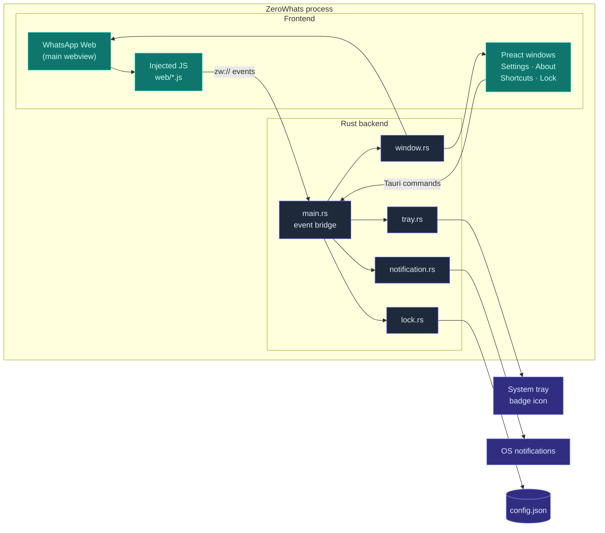
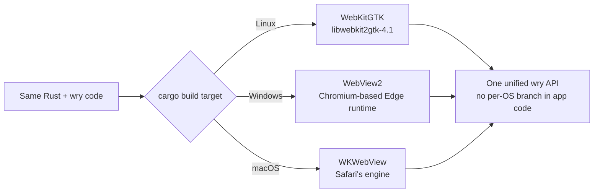
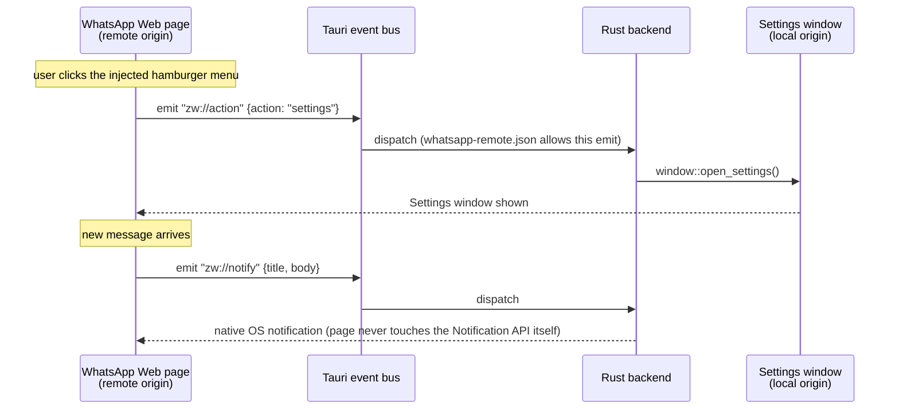
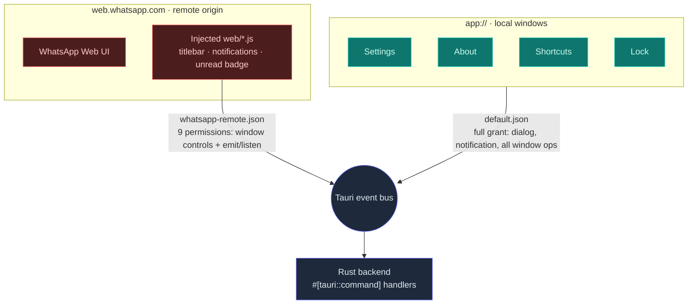

# Building ZeroWhats: Rust, Tauri, and the Case Against Bundling a Browser

**No Electron. No bundled browser. No telemetry.** ZeroWhats is a WhatsApp Web desktop client for Linux, macOS, and Windows, built on [Tauri](https://tauri.app) and [Preact](https://preactjs.com): native OS notifications, an app lock with auto-lock, a tray unread counter, a WhatsApp-only navigation sandbox, and a binary that ships at a few megabytes instead of a few hundred.

<br />

The full source is on GitHub — [**ZauJulio/ZeroWhats**](https://github.com/ZauJulio/ZeroWhats). I'd recommend keeping it open while you read; every snippet here points at real code you can grep.

This post is the technical story: why wry beat Servo, Gecko, and CEF for this job; how the security model is scoped capability by capability (with the actual JSON); why Preact, why Rust, and what it all costs in real numbers from the shipped artifacts. I also compare it honestly against Karere, ZapZap, and Ferdium — and cover where AI helped in the process, and where it didn't.

<br />

<ImageCarousel>
  
  
</ImageCarousel>

<nav className="article-toc" aria-label="Contents">

- [Building ZeroWhats: Rust, Tauri, and the Case Against Bundling a Browser](#building-zerowhats-rust-tauri-and-the-case-against-bundling-a-browser)
  - [Why Build Another WhatsApp Client](#why-build-another-whatsapp-client)
  - [Architecture at a Glance](#architecture-at-a-glance)
  - [The Core Bet: Tauri, Wry, and an OS-Picked Webview](#the-core-bet-tauri-wry-and-an-os-picked-webview)
  - [The Webview Engines I Actually Considered](#the-webview-engines-i-actually-considered)
    - [Servo, via Verso](#servo-via-verso)
    - [Gecko: No Door In](#gecko-no-door-in)
    - [CEF: Karere's Own Case Study](#cef-kareres-own-case-study)
  - [Why Not Karere, ZapZap, Ferdium, or Franz](#why-not-karere-zapzap-ferdium-or-franz)
  - [One Webview, Not Two](#one-webview-not-two)
    - [A WebKitGTK Quirk Hiding in the User-Agent String](#a-webkitgtk-quirk-hiding-in-the-user-agent-string)
    - [The Sandbox Isn't a Slogan](#the-sandbox-isnt-a-slogan)
  - [The zw:// Event Bridge](#the-zw-event-bridge)
  - [The Security Model, Honestly](#the-security-model-honestly)
  - [Why Preact for Four Small Windows](#why-preact-for-four-small-windows)
  - [Why Rust for the Backend](#why-rust-for-the-backend)
  - [What It Actually Costs](#what-it-actually-costs)
  - [Where AI Helped, and Where It Didn't](#where-ai-helped-and-where-it-didnt)
  - [Try It](#try-it)

</nav>

## Why Build Another WhatsApp Client

WhatsApp Web already runs in any browser tab. The gap is everything a tab structurally can't give you: a real dock/taskbar identity, native OS notifications instead of the browser's permission-gated Web Notifications, a persistent tray presence with an unread badge, global keyboard shortcuts, and a lock screen that survives you walking away from your desk. The official desktop app closes part of that gap, and a handful of community clients close the rest — Karere, ZapZap, the WhatsApp "recipe" inside Ferdium — each making a different bet on how to render the page and how much app to build around it.

ZeroWhats's bet is to keep the surface area as small as the problem allows: one webview, pointed at WhatsApp and nowhere else, plus a handful of small auxiliary windows for the things WhatsApp Web itself doesn't offer — settings, an app lock, keyboard shortcuts. No account system, no telemetry, no second rendering engine to patch. Everything below is the reasoning behind each piece of that bet, including the parts I'd change.

## Architecture at a Glance

One frameless window loads `web.whatsapp.com` directly — untouched, it's WhatsApp's own web app, not a reimplementation. A set of small JavaScript files is injected into that page to add an in-page titlebar, bridge native notifications, and report the unread count back to Rust. Everything else — Settings, About, Shortcuts, the Lock screen — is a separate small frameless Preact window talking to the same Rust backend over typed Tauri commands.



The backend is nine focused Rust modules (`window`, `lock`, `notification`, `tray`, `commands`, `config`, `password`, `clipboard`, `scripts`) plus the `web/*.js` scripts they inject — no monolith, no shared mutable god-object. `main.rs` is just the wiring between them.

## The Core Bet: Tauri, Wry, and an OS-Picked Webview

Tauri doesn't ship a browser engine. It ships [wry](https://github.com/tauri-apps/wry), a Rust crate that binds to whichever engine the target OS already has: `webkit2gtk` on Linux, the WebView2 loader (Chromium-based, part of modern Windows) on Windows, `WKWebView`'s Objective-C bridge on macOS, and the platform WebView on Android for mobile targets.

"Automatic" doesn't mean the app probes for the best engine at runtime and picks one — it means I never write that branch at all. The same `tauri::WebviewWindowBuilder` call in `window.rs` compiles to three different rendering engines depending on which target you build for, behind one Rust API:



That single decision is where most of the rest of this article comes from. Not bundling an engine means not bundling Chromium, which means the binary stays in the low single-digit megabytes instead of the low hundreds — and it means security patches for the actual browser engine ride the OS's own update channel instead of my release pipeline. It also means accepting whatever that OS-shipped engine can and can't do, which is a real cost, not a free lunch — the WebKitGTK-specific fixes later in this post are exactly that bill coming due.

Tauri does let you swap the whole runtime layer — that's what `tauri-runtime-verso` does for Servo, further down — but that's a fundamentally bigger commitment than a config flag. You're replacing wry's windowing and IPC plumbing wholesale, not choosing an engine within it.

## The Webview Engines I Actually Considered

Before settling on "let wry pick," I looked at the other ways to get a web engine into a Rust desktop app.

| Engine / path in                                            | Integration model                                                          | Where it stood                                                                                                                                                 | Verdict                                                                                                                                  |
| ----------------------------------------------------------- | -------------------------------------------------------------------------- | -------------------------------------------------------------------------------------------------------------------------------------------------------------- | ---------------------------------------------------------------------------------------------------------------------------------------- |
| **System webview via wry** (WebKitGTK, WebView2, WKWebView) | Tauri's default runtime (`tauri-runtime-wry`)                              | Production-grade — every Tauri 1.x/2.x app shipping today runs this                                                                                            | **Chosen**                                                                                                                               |
| **Servo, via Verso**                                        | A separate custom Tauri runtime, `tauri-runtime-verso` — not a wry backend | Experimental, NLnet-funded; at integration time it covered only a subset of Tauri's window features — no decorations, no transparency, no per-window menus yet | Not yet — ZeroWhats needs a transparent, frameless, tray-driven window today                                                             |
| **Gecko** (Firefox's engine)                                | No maintained third-party embedding API                                    | Mozilla dropped general-purpose Gecko embedding around 2011; GeckoView is the only maintained embedding path, and it's Android-only                            | Ruled out — there's no supported door in                                                                                                 |
| **CEF** (Chromium Embedded Framework)                       | Its own runtime; replaces wry entirely — own windowing, own IPC            | Mature and proven — Karere itself moved to it in its 4.0 rewrite                                                                                               | Rejected — ships a private Chromium build per OS/arch, on my own patch cadence, which is the exact cost a system webview exists to avoid |
| **Bundled Chromium via Electron**                           | A different framework, not a webview choice                                | Mature, fully consistent across OSes                                                                                                                           | Rejected — same bundled-browser cost as CEF, plus a bundled Node.js runtime on top                                                       |

### Servo, via Verso

This is the option I'd genuinely like to revisit. [Verso](https://github.com/versotile-org/tauri-runtime-verso) embeds [Servo](https://servo.org/) — the Rust browser engine — as an alternative Tauri runtime, and the Tauri team has been shipping it as an official experiment, backed by NLnet grant funding, specifically aimed at giving Tauri a memory-safe engine with no C++ in it at all. That's ideologically the closest thing to what a Rust-first desktop framework "should" run on.

It just isn't there yet for this app. At the point I evaluated it, `tauri-runtime-verso` supported a subset of what `tauri-runtime-wry` does — no window decorations, no transparency, no per-window menus beyond a macOS-wide menu — and ZeroWhats's main window is frameless, transparent, and CSS-rounded from day one. The Tauri team's own roadmap talks about an "evergreen" shared Verso runtime, distributed and auto-updated the way WebView2 is on Windows, which would remove the "who patches this Chromium-sized thing" question that rules out CEF below. If that lands, it's the most likely thing to eventually replace wry here. Today, it would mean shipping a worse window for a better story.

### Gecko: No Door In

Gecko didn't make it to a real evaluation, because there was nothing to evaluate. Mozilla killed general-purpose Gecko embedding around 2011 — the API existed for things like the old Galeon browser, and Mozilla's own embedding module owner cited the complexity of the shift to multi-process Firefox and a deliberate decision to prioritize Firefox itself over supporting third-party embedders. What's left is under-documented and not meaningfully maintained; the only actively maintained embedding surface, GeckoView, is Android-only. There's no equivalent of WebView2 or WebKitGTK for Gecko on desktop. It's a real, well-known gap in the ecosystem, not an oversight on my part.

### CEF: Karere's Own Case Study

CEF is the most defensible alternative on this list, and I don't have to speculate about what choosing it would have cost — [Karere](https://github.com/tobagin/karere), a GTK4/Libadwaita WhatsApp client for Linux, ran the experiment for me. Karere shipped on WebKitGTK first, then rewrote its rendering backend to CEF in its 4.0 release to get full video-attachment playback and isolated multi-account sessions — real capabilities WebKitGTK made hard. That's a legitimate trade, and it bought Karere something genuine.

It's also exactly the cost a system-webview approach is built to avoid: CEF means embedding a private Chromium build, one per OS and architecture, patched on your own schedule instead of the OS's. It doesn't plug into wry — adopting it is a runtime replacement, not a config change — and it reintroduces the "you now own Chromium's security patch cadence" problem that not bundling a browser was supposed to solve in the first place. For a single-purpose app whose main pitch is "small, sandboxed, and lives on the OS's own patch cycle," that trade didn't clear the bar.

## Why Not Karere, ZapZap, Ferdium, or Franz

The engine question is one layer. The other is: several of these already exist as finished apps — why is ZeroWhats a defensible use of anyone's time, including mine?

| Client                                     | Shell / language             | Rendering engine                                    | Scope                                                       | Footprint shape                             |
| ------------------------------------------ | ---------------------------- | --------------------------------------------------- | ----------------------------------------------------------- | ------------------------------------------- |
| **ZeroWhats**                              | Rust (Tauri 2) + Preact      | System webview (WebKitGTK / WebView2 / WKWebView)   | WhatsApp only, sandboxed navigation                         | ~2–4 MB native package; no bundled browser  |
| **Karere** (≥4.0)                          | GTK4/Libadwaita native shell | CEF — bundled Chromium (moved off WebKitGTK in 4.0) | WhatsApp only, multi-account                                | Bundles a private Chromium runtime          |
| **ZapZap**                                 | Python + PyQt6               | QtWebEngine — bundled Chromium                      | WhatsApp only                                               | Bundled Chromium plus the Python/Qt runtime |
| **Ferdium** (fork of Ferdi, fork of Franz) | Electron (Node.js)           | Bundled Chromium                                    | Dozens of chat services — WhatsApp is one recipe among many | Full Electron footprint, by design          |
| **WhatsApp Desktop** (official)            | Electron, confirmed on macOS | Bundled Chromium                                    | WhatsApp only, official                                     | Electron footprint                          |

None of this is a knock on the others — it's a different bet. Ferdium's whole reason to exist is breadth: if you already run Slack, Discord, and four other services through one aggregator, its Electron cost is amortized across all of them, and WhatsApp is just one more recipe in a bigger app; that's a fair trade for what Ferdium is trying to be, and its Franz/Ferdi lineage is specifically about doing that without a paid account tier or telemetry, a lineage worth respecting. Karere's CEF rewrite bought it multi-account isolation and full media-codec compatibility by accepting the bundled-Chromium cost ZeroWhats was built specifically to avoid. ZapZap gets the same Chromium-grade compatibility through Qt's WebEngine, plus a Python runtime on top.

ZeroWhats is trying to be one thing: a single WhatsApp window, sandboxed to WhatsApp and nothing else, with the smallest attack surface and dependency footprint I could get away with, using an engine the OS already ships and already patches. That means giving up multi-account support and CEF-grade media compatibility. In exchange you get a client where the entire remote-facing capability grant is nine permissions in one auditable JSON file (below), and a binary small enough, and a codebase simple enough, to read in full in an afternoon.

## One Webview, Not Two

WhatsApp Web is the only thing rendered by a browser engine in the main window — the custom titlebar isn't a second webview stacked on top of it. It's DOM injected into the same page, styled to look like app chrome. The reasoning is blunt, straight from the code: a stacked second webview breaks input handling on Linux, so there's exactly one webview per window, full stop.

The window itself is frameless and transparent, with rounded corners painted by CSS instead of window-manager decorations, which runs into a real Wayland compositor quirk: a transparent, rounded window shown before its first composited frame paints can get stuck rendering opaque, because the alpha visual isn't picked up until a frame actually lands. The fix is unglamorous — the window is always created hidden, and the injected `rounded-corners.js` reveals it on the next frame once the rounding stylesheet is already in place (or the lock screen reveals it later, if a password is set). It's a small detail, but it's the difference between "looks polished" and "flashes white on launch" on a chunk of Linux desktops.

### A WebKitGTK Quirk Hiding in the User-Agent String

Here's a concrete example of what "the system webview" costs in practice, and how ZeroWhats pays it. WhatsApp Web serves different code to different browser engines, reasonably, since Chrome/Blink and Safari/WebKit don't render identically. The obvious move would be spoofing a Chrome user-agent so WhatsApp serves its best-tested path. ZeroWhats does the opposite — it advertises a genuine Safari-on-macOS user-agent by default:

```rust
// Safari on macOS. Since the runtime engine *is* WebKit, advertising a
// real WebKit browser makes WhatsApp Web serve the Safari/WebKit code
// path — the one it actually tests against for WebKit — which fixes
// sticker (animated WebP) and emoji rendering that broke under the
// Chrome spoof above.
"Mozilla/5.0 (Macintosh; Intel Mac OS X 10_15_7) AppleWebKit/605.1.15 ..."
```

The runtime engine actually rendering the page is WebKit. Spoofing Chrome gets WhatsApp's Blink code path, which WebKitGTK then renders imperfectly — animated stickers and some emoji break. Telling the truth about the engine gets WhatsApp's Safari/WebKit-tested path instead, and they render correctly. It's a small inversion: lying less, not more, fixes the bug, and it only works because the app is honest with itself about which engine it's actually running on. (A lighter mobile UA and the old Chrome spoof are still available behind `ZW_LIGHT_UA`/`ZW_CHROME_UA` environment variables, kept for A/B-testing rendering and memory footprint, not for production use.)

### The Sandbox Isn't a Slogan

"WhatsApp-only sandbox" is a README bullet point, and also three lines of code. Every navigation event inside the main window is checked against an allow-list before it's permitted; anything that isn't `web.whatsapp.com`, a `*.whatsapp.com`/`*.whatsapp.net` host (WhatsApp serves media from its own CDN subdomains), or an in-page `about:`/`blob:`/`data:` URL is rejected outright and handed to the OS's default browser instead:

```rust
fn allow_navigation(app: &AppHandle, url: &Url) -> bool {
    if is_whatsapp_url(url) {
        return true;
    }
    if matches!(url.scheme(), "http" | "https") {
        commands::open_external(app, url.as_str());
    }
    false
}
```

A shared link, a scam ad inside a group chat, a phishing redirect — none of it can render inside the app's own process. It opens in whatever browser you'd have clicked it in anyway, with whatever protections that browser already has.

## The zw:// Event Bridge

The titlebar lives inside `web.whatsapp.com` — a remote origin. Tauri's security model draws a hard line there: a remote page may call Tauri's built-in **core** commands if a capability grants it, but it can never call ZeroWhats's own `#[tauri::command]` functions — those are reachable only from the app's local windows. That's not a workaround to route around; it's the correct behavior for a page whose JavaScript you don't control.

So the injected scripts don't call anything. They emit events — `zw://action`, `zw://unread`, `zw://notify`, `zw://open-external` — and `main.rs` listens for exactly those names and dispatches to the real backend logic:



The remote page can shout into a mailbox; it can't pick up the phone. That fixed, named-event surface is also the security story in one sentence: it's not "the remote page can trigger arbitrary backend behavior," it's "the remote page can emit one of four specific, harmless-by-construction signals, and Rust alone decides what happens next."

## The Security Model, Honestly

Capability scoping is where Tauri 2's permission system earns its keep, and it's worth showing the actual files instead of describing them. Every window's grant lives in `src-tauri/capabilities/`, split in two.

The default capability — everything the local `app://` windows get:

```json
{
  "identifier": "default",
  "windows": ["main", "settings", "about", "shortcuts", "lock"],
  "permissions": [
    "core:default",
    "core:app:allow-version",
    "core:event:allow-emit",
    "core:event:allow-listen",
    "core:event:allow-unlisten",
    "core:window:allow-start-dragging",
    "core:window:allow-close",
    "core:window:allow-hide",
    "core:window:allow-show",
    "core:window:allow-minimize",
    "core:window:allow-unminimize",
    "core:window:allow-set-fullscreen",
    "core:window:allow-set-focus",
    "core:window:allow-is-visible",
    "dialog:default",
    "notification:default"
  ]
}
```

And the grant for the one remote origin allowed anywhere in the app:

```json
{
  "identifier": "whatsapp-remote",
  "windows": ["main"],
  "remote": { "urls": ["https://web.whatsapp.com", "https://*.whatsapp.com"] },
  "permissions": [
    "core:window:allow-start-dragging",
    "core:window:allow-start-resize-dragging",
    "core:window:allow-minimize",
    "core:window:allow-close",
    "core:window:allow-toggle-maximize",
    "core:window:allow-is-maximized",
    "core:window:allow-set-fullscreen",
    "core:event:allow-emit",
    "core:event:allow-listen"
  ]
}
```

Nine permissions — window-chrome controls plus emit/listen. No dialog, no notification, no filesystem, nothing that touches the password or the config file. That is the entire reachable surface from `web.whatsapp.com`, in one file you can read in thirty seconds. Tauri only applies a `remote` grant to a capability that explicitly declares one, and `default.json` deliberately doesn't — so none of its broader grant leaks to the WhatsApp origin by accident.



Local content also runs under a strict CSP (`app.security.csp` in `tauri.conf.json`):

```
default-src 'self'; img-src 'self' asset: data: https://asset.localhost; style-src 'self' 'unsafe-inline'; font-src 'self' data:; connect-src 'self' ipc: http://ipc.localhost; script-src 'self'
```

The app lock follows the same "say exactly what it does and doesn't do" instinct. The password is hashed with Argon2id, and only the hash is stored, in `config.json`, in the OS's standard app-config directory — never the password itself. Forgetting it means re-authenticating as a system admin: `pkexec` on Linux, an AppleScript admin prompt on macOS, a UAC-elevated PowerShell process on Windows — a real OS credential check, not an app-level one:

```rust
#[cfg(target_os = "linux")]
pub fn reset_with_admin() -> bool {
    std::process::Command::new("pkexec")
        .arg("/bin/true")
        .status()
        .map(|status| status.success())
        .unwrap_or(false)
}
```

And then the honest part, copied straight from `SECURITY.md` because softening it would defeat the point: ZeroWhats is pre-1.0 and unaudited. Unlock has no brute-force throttling — it checks the Argon2id hash with no rate limit, so the lock deters casual access to an unattended laptop, not a determined attacker with a disk image. `config.json` is a plain file, not the OS keyring/Secret Service, so anyone who can read it can attack the hash offline. Releases are unsigned by default — code signing is opt-in in CI, gated on the maintainer's certificates — so expect Gatekeeper/SmartScreen warnings until that's configured. None of that is buried in fine print; it's the top of the security policy, because a threat model you don't state is a threat model you're quietly lying about.

## Why Preact for Four Small Windows

WhatsApp's own UI needs zero frontend framework from ZeroWhats — the main window just loads `web.whatsapp.com` and gets WhatsApp's own app, untouched. The only UI code ZeroWhats ships is for Settings, About, Shortcuts, and the Lock screen: four small, independent windows, each its own webview instance with its own JS bundle to load.

That last part is why Preact specifically, not React. A bundle-size difference that's a rounding error in a typical single-page app multiplies by every window that loads it separately, and these are windows that need to open instantly from a tray click or an idle-timeout lock, not warm up a router and a state-management story. Preact's API is close enough to React that `@preact/preset-vite` plus a couple of `@types/react` shims made the port effectively free, at a fraction of the payload. For four small, frequently-opened, framework-light windows sitting next to a project-wide philosophy of "small binary, small everything," pulling in full React would have been the odd choice, not Preact.

## Why Rust for the Backend

Three separate needs pointed at Rust, not just one.

The first is Tauri itself: wry, the plugin ecosystem (`tauri-plugin-autostart`, `-window-state`, `-single-instance`, `-notification`, `-dialog`, `-log`, `-opener`), and the whole "thin shell around a system webview" model are Rust-native. Building on Tauri without writing Rust isn't really on the table.

The second is the systems-level reach the app actually needs: spawning `pkexec`/`osascript`/an elevated PowerShell process for the admin-reset flow; reading the OS clipboard's raw image bytes through `arboard`, a gap WebKitGTK itself can't close (the page can't get image data straight from the system clipboard — [WebKit bug #218519](https://bugs.webkit.org/show_bug.cgi?id=218519) — so the Rust side reads it and re-encodes it to a data URL for the page); and reaching past Tauri's own API surface into the raw `webkit2gtk` crate to toggle enchant spell-check and its dictionaries, since no Tauri API exposes that. That's FFI-and-OS-API work Rust's crate ecosystem makes tractable without hand-writing unsafe C bindings.

The third is the size budget itself. The release profile is tuned, not left at the default:

```toml
[profile.release]
opt-level = "s"
lto = true
codegen-units = 1
panic = "abort"
strip = true
```

`opt-level = "s"` optimizes for size without `"z"`'s runtime cost; LTO plus a single codegen unit lets the compiler inline and dead-code-eliminate across the whole dependency graph instead of per-crate, at the cost of slower builds; `panic = "abort"` drops the unwinding tables a `panic = "unwind"` binary carries for exception safety this app doesn't need; `strip = true` removes debug symbols from the shipped binary. None of those levers exist for a JavaScript runtime — they only exist because the backend compiles to native code in the first place.

## What It Actually Costs

Numbers beat adjectives, so here are the real ones — the actual artifacts published for release v1.4.0:

| Package             | Platform | Size    | Why                                                      |
| ------------------- | -------- | ------- | -------------------------------------------------------- |
| `.deb` (amd64)      | Linux    | ~3.5 MB | WebKitGTK is a declared system dependency, not bundled   |
| `.rpm` (x86_64)     | Linux    | ~3.5 MB | Same                                                     |
| `.msi`              | Windows  | ~2.5 MB | WebView2 ships with the OS                               |
| `-setup.exe`        | Windows  | ~1.8 MB | Same                                                     |
| `.dmg`              | macOS    | ~2.8 MB | WKWebView ships with the OS                              |
| `.AppImage` (amd64) | Linux    | ~81 MB  | Bundles GTK/WebKitGTK for distro-independent portability |
| `.snap` (amd64)     | Linux    | ~131 MB | Bundles its own content/runtime snaps                    |

The spread inside that table is the whole architecture in miniature. The packages that lean on a webview the OS already ships stay in the low single-digit megabytes; the two formats that trade that assumption for portability — bundling enough of the GTK/WebKit stack to run, unmodified, on any distro — balloon by roughly 25–35×. That's not inefficiency; it's the literal price of what they're buying you.

For scale, a bare, feature-empty Electron app is commonly benchmarked around 150–200 MB installed before a single application dependency, because it always bundles a full Chromium and a Node.js runtime, with no OS-webview escape hatch available. That puts it on the order of ZeroWhats's most bundled format (the Snap) and roughly 40–90× its native Linux packages, Windows installer, or macOS disk image.

I haven't published a formal idle-RAM benchmark — that's an honest gap, not modesty, and a precise number would be somewhat misleading anyway: the memory cost of ZeroWhats is almost entirely whichever engine process is rendering `web.whatsapp.com`, the same WebKitGTK/WebView2/WKWebView cost you'd pay for that page open in an ordinary browser tab, because WhatsApp Web is a genuinely heavy React SPA regardless of who's hosting it. The Rust backend next to it is a thin, mostly-idle supervisor — no polling loops, no persistent background work beyond the tray and the optional auto-lock idle timer. There's a `ZW_MINIMAL` environment variable, used during development, that disables the background-sync/notification/badge scripts specifically to isolate that backend cost for measurement — the start of a real benchmark, not a finished one.

## Where AI Helped, and Where It Didn't

A fair question for anything built in 2026: where did AI fit into ZeroWhats?

As a sounding board, not an author. I used it to argue through trade-offs out loud before committing to them — the webview-engine comparison above, the shape of the capability split between `default.json` and `whatsapp-remote.json`, whether an event bridge or a narrower exposed-command surface was the right answer to "a remote origin needs to trigger some backend behavior." I used it to speed up debugging sessions — the kind where you're staring at a rendering difference between two user-agents, or a blob download that silently never reaches WebKitGTK's own download machinery, and you want a second opinion on where to even start looking before printf-debugging a browser engine. And, for this article specifically, I used it to check my claims about other people's projects — Karere's CEF migration, Verso's current feature coverage, what actually happened to Gecko's embedding API — against current documentation, because getting that wrong in public would be worse than not writing it at all.

What it didn't do: decide that one webview beats two, write the capability JSON and mean it, choose Argon2id and store only the hash, hand-roll a tray badge renderer instead of pulling in an image crate for a 16-pixel font, or pick Tauri over Electron in the first place. Those calls — and the code and the trade-offs behind every one of them in this article — are mine, reviewed and understood by me before they shipped, not generated and accepted. AI is a fast, occasionally-wrong collaborator I keep on a short leash. It's not on the commit log, and it's not a co-author.

## Try It

ZeroWhats is MIT-licensed and on GitHub. Grab an installer from the [latest release](https://github.com/ZauJulio/ZeroWhats/releases) — `.AppImage`/`.deb`/`.rpm` for Linux, `.msi`/`.exe` for Windows, `.dmg` for macOS — or read the source, all of it, in an afternoon.

```bash
git clone https://github.com/ZauJulio/ZeroWhats.git
cd ZeroWhats
bun install
bun run tauri dev
```

If you find a WebKitGTK quirk I haven't worked around yet, or a capability scoped wider than it needs to be, that's exactly the kind of issue and PR I want.

<br />

---

<br />

> ZeroWhats is not affiliated with WhatsApp or Meta — it's a client, not a fork. If the sandboxing model or the capability-scoping approach here is useful for your own Tauri app, take it; the source is right there.
