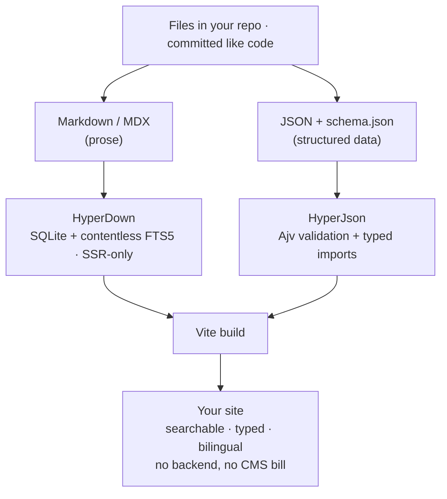
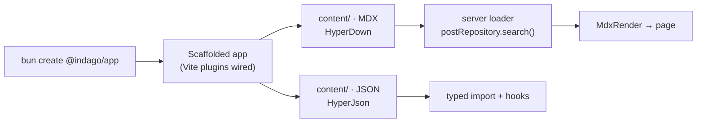
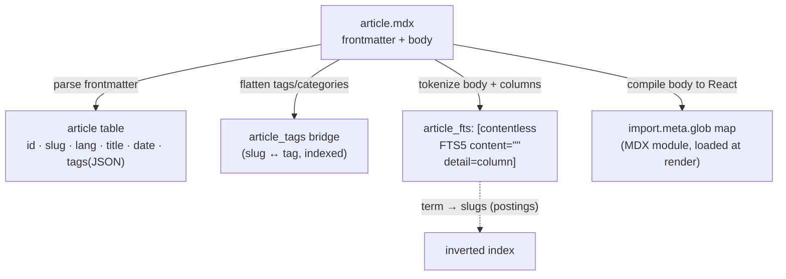
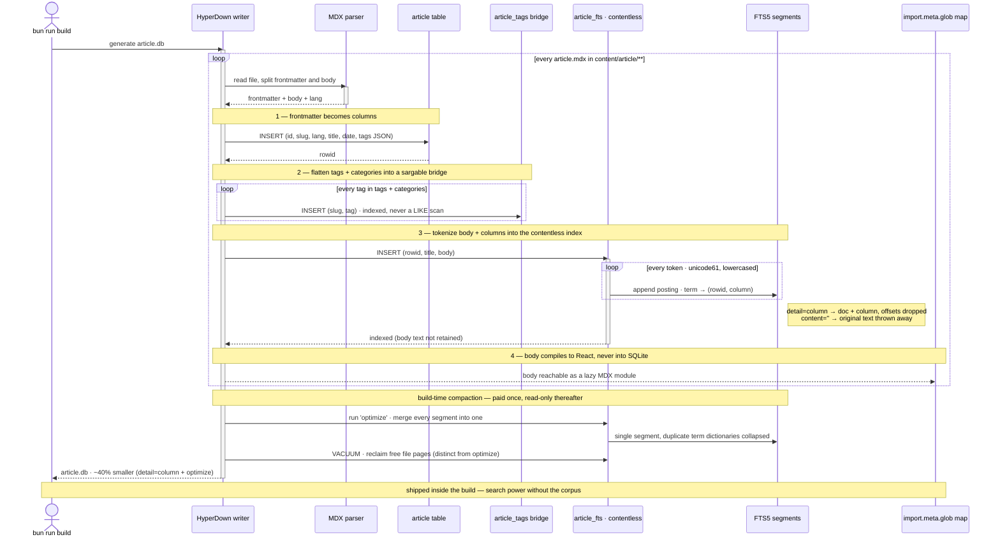
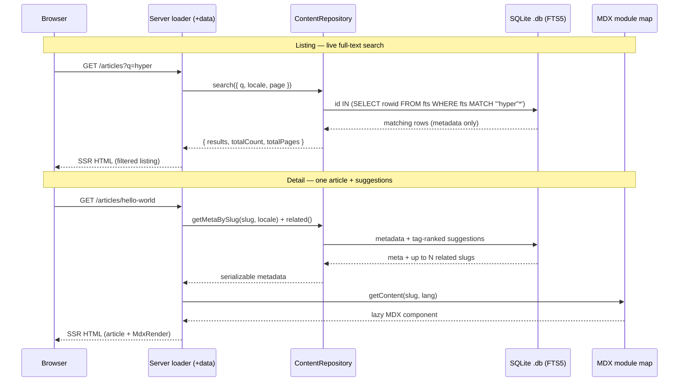
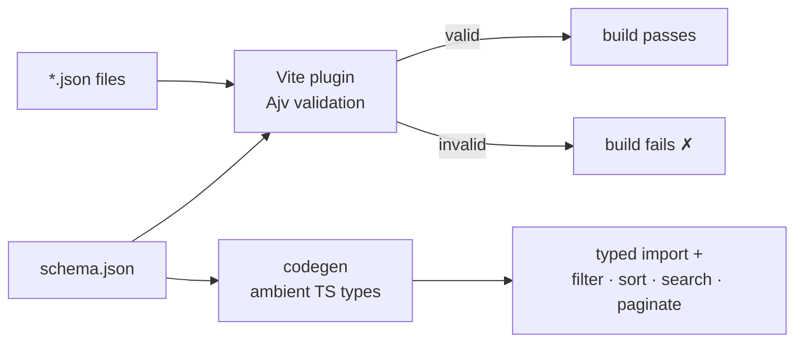

import { ScaffoldBox } from "@/components/mdx/ScaffoldBox";

# Getting Started with Indago

**Indago** is a build-time content toolkit — two independent engines that turn files in your repo
into a searchable, typed content layer with no backend to run. This guide covers what each engine
does, how the storage model works under the hood, and how to go from one command to a working setup.
The deep dive on HyperDown's contentless index is the meat of it; use the sidebar to jump around.

## What is Indago? #[start/#a855f7]

Most "headless CMS" setups ask the same three things of you: run a service, pay for it, and reach
across the network on every request. Indago takes the opposite bet — **do everything at build
time**. Your content is just files in your repository. A Vite plugin reads them, validates them,
and emits artifacts your server-side loaders query locally. There is **no client-side database**
and **no runtime API** to keep awake.

The payoff is a content layer that is fast, typed end-to-end, internationalised, and entirely
yours — versioned in git right next to your code. Indago delivers this through **two independent
engines** that split the work by the _shape_ of your content:

- **[HyperDown](https://www.npmjs.com/package/@indago/hyper-down)** owns **prose** — articles,
  docs, recipes: anything with a body you want to read and search.
- **[HyperJson](https://www.npmjs.com/package/@indago/hyper-json)** owns **structured data** —
  projects, skills, playlists: anything that is a list of records with a fixed shape.

They share no code and have no dependency on each other. The only thing they have in common is a
`content/` folder and the convention of locale subfolders. Use one, the other, or both.



The diagram reads top to bottom: files in, an engine each, one build, a site out. Everything below
is just an expansion of that single line — first the one command that wires it together, then each
engine in depth.

## Scaffold in one command

You do not assemble Indago by hand. The scaffolder wires both engines into a ready-to-run app, with
the Vite plugins registered, a `hyperdown.config.json` in place, and example content already
present. Pick your framework and copy the command:

<ScaffoldBox projectName="my-app" />

It scaffolds the project, installs dependencies, and leaves you one command from a dev server. Every
template ships the same routes and content folders, so the rest of this guide applies whichever
framework you picked.



With the project in place, let's open up the engine that does the heavy lifting.

## @indago/HyperDown — prose into searchable SQLite #[deep dive/#0ea5e9]

HyperDown is the larger of the two engines, and the more interesting one, because it solves a
problem most static sites quietly give up on: **real full-text search over prose, with no backend**.
This is the part worth understanding deeply, so we'll go from _what it does_ to _how it stores
things_ to _what happens on a request_ before writing a line of app code.

### What it does

Point HyperDown at a folder of Markdown/MDX and, at build time, it writes a compact **SQLite**
database. That database holds **only the front-matter metadata** — title, tags, dates, slug, locale.
The body of each file is never stored; instead it is tokenized into a full-text index and, for
rendering, loaded lazily from a separate Vite module map. At request time, a typed
`ContentRepository` queries the database on the server — full-text search, faceted filters, sorting,
pagination, by-slug lookups, and tag-ranked "related" suggestions — and the matching MDX body is
resolved and rendered as a React component.

### How it works: the contentless inverted index

Here is the storage model, and the diagram every other claim in this section refers back to:



Read it as four destinations for one file. The front-matter becomes **columns** in a normal SQLite
table. `tags` and `categories` are additionally flattened into an indexed **bridge table** so tag
filters and facet counts are sargable (an indexed join, never a `LIKE` scan). The body and the
columns are **tokenized into an FTS5 virtual table**. And the body, separately, is compiled to a
React component reachable through a static `import.meta.glob` map — never through SQLite. Let's take
the three storage ideas in turn.

**The inverted index.** A normal table answers "given this row, what are its words?" An _inverted_
index answers the question search actually asks: "given this word, which rows contain it?" It is the
classic inversion — instead of `document → terms`, it stores `term → list of documents` (each term's
list is its **postings list**). That is what turns "find every article mentioning `hyperdown`" into
a dictionary lookup plus a postings read — `O(matches)` — instead of a full scan over every body.
SQLite's **FTS5** gives you this inverted index for free, and `ContentRepository` uses it as a pure
membership filter: `id IN (SELECT rowid FROM article_fts WHERE article_fts MATCH '"hyper"*')`.

**Contentless (`content=""`).** By default an FTS5 table keeps a copy of the original text so it can
return it. HyperDown declares the table **contentless** — `fts5(..., content="")` — which keeps the
inverted index but **throws the original text away**. You can still search every word; you just
can't reconstruct the body _from the index_. And you don't need to: HyperDown already loads the body
from the MDX module map at render time. The result is a `.db` that carries the search power of the
full corpus without carrying the corpus, so it stays small enough to ship inside the build.

**The `detail` mode — `full` vs `column` vs `none`.** Within a contentless index there is still a
choice about _how much positional information_ each token occurrence records, and it is the single
biggest lever on index size:

| `detail`        | stores per token        | still supports                                 | index size¹ |
| --------------- | ----------------------- | ---------------------------------------------- | ----------- |
| `full`          | doc + column + position | everything (phrase, `NEAR`, positional `bm25`) | **100%**    |
| `column` (ours) | doc + column            | term, prefix, boolean, `column:term`           | ~58%        |
| `none`          | doc only                | term, prefix, boolean only                     | ~46%        |

> ¹ Ratios measured on this project's article corpus, post-`optimize`. Absolute numbers vary with
> content; the ordering holds.

The default, `detail=full`, records _where in the column_ every token sits — the offsets that power
phrase queries (`"getting started"` as an adjacent sequence), `NEAR`, and positional `bm25` ranking.
HyperDown does none of that: it only emits prefix + boolean queries and never calls `bm25()`. So it
drops to **`detail="column"`**, which still records _which column_ a token lives in — enough to
support a future "search only in titles" (`title:term`) — but discards the offsets. We deliberately
stop at `column` rather than the even-smaller `none`: `none` would forbid `column:term` queries
forever without a schema migration and full rebuild, so `column` is the frugal-but-not-painted-into-
a-corner middle ground. Switching is a one-line change in the engine.

**Build-time `optimize` and segments.** Inserting rows one at a time leaves the FTS index split
across many on-disk **segments**, each repeating its own term dictionary — the same term's postings
end up fragmented across all of them. After the inserts, the writer runs FTS5's `'optimize'`, which
merges every segment into one and collapses the duplicated overhead. This is **distinct from
`VACUUM`**, which only reclaims free _file_ pages and never touches the FTS segments — so the writer
runs both, back to back. Because the `.db` is generated once at build and read-only thereafter, this
`O(index size)` pass is paid a single time and every visitor reads the compacted result for free.
Together, `detail="column"` plus `optimize` cut the index by roughly **40%** versus the untuned
default — a tiny change in the engine, zero runtime cost.

**The write path, end to end.** The map above is one file fanning out to four destinations; here is
the same model _in motion_ — exactly what the build-time writer does, in order, to turn a folder of
MDX into the compacted, contentless `.db` that ships. Watch how the inverted index is built one
posting at a time, what `content=""` and `detail="column"` discard at insert, and where `optimize`
and `VACUUM` come in at the end:



The four numbered notes line up one-to-one with the four arrows of the storage map: columns, the tag
bridge, the contentless FTS insert, and the React module. The two inner loops are the parts a static
diagram can't show — the bridge gets one indexed row _per tag_, and the index grows one posting _per
token_, which is precisely where `content=""` drops the source text and `detail="column"` drops the
offsets. Everything after the file loop is the one-time compaction that earns the ~40%.

### The request lifecycle

Storage is half the story; the other half is what happens when a visitor hits a route. Because
SQLite is queried **only on the server**, every database touch lives in a route loader. Here is the
full path for both a listing search and a detail page:



Two things to notice. First, the metadata and the body travel **separate paths** — the loader gets
JSON-serializable metadata from SQLite, while the body is resolved from the module map in the
component. That separation is exactly what the contentless index buys you. Second, the FTS match runs
across **all locales** and maps back to slugs, so "slow" and "lenta" surface the same article; the
`locale` filter then returns one row per slug in the requested language.

### How to use it

With the model clear, the API is small. Register a content type and create an item with the CLI:

```bash
bunx @indago/hyper-down create-content --name post --folder Posts --fields "title:string:req,tags:tags:opt"
bunx @indago/hyper-down create-item --type post --slug hello-world --lang en
```

The build codegen writes a typed, **server-only** `postRepository` into your app's `.hyper-down/`
tree. Import it **only from a loader** and run a search:

```ts
import { postRepository } from "@hyper-down/content/post/builder";

export async function data() {
  const { results } = await postRepository.search({
    searchQuery: "hello", // FTS5 across all locales
    locale: "en",
    pagination: { page: 1, pageSize: 10 },
  });

  return { results };
}
```

Then, in the view, resolve the MDX module and render it with `MdxRender`:

```tsx
import { MdxRender } from "@indago/hyper-down";

import { getPostContent } from "./data";

export function Post({ slug, locale }: { slug: string; locale: string }) {
  return <MdxRender content={getPostContent(slug, locale)} />;
}
```

That is the whole loop: define a type, query it on the server, render the body in the component.

### Composed indexing & sidebars

By default a collection is indexed **per page** — the whole body becomes one searchable document.
Opt a collection into **composed** indexing and HyperDown _also_ indexes every heading section:

```jsonc
// hyperdown.config.json
{
  "database": {
    "indexByCollection": { "post": "composed" },
  },
}
```

A composed collection gains a `<type>_sections` table with its own per-section FTS index, and a
`sections` column holding the **heading tree**. Search hits can then deep-link to `#anchors`, and
each item's `meta.sections` feeds the batteries-included `<Sidebar/>` — exactly the one rendering the
navigation on the left of this page. Headings can even declare a sidebar pill inline with the
`#[label/#color]` badge syntax (the pills beside the headings above are precisely that).

## @indago/HyperJson — JSON Schema into typed content

Prose is only half of most sites. The other half — your projects list, your skills, a playlist — is
**structured data**, and forcing it through a Markdown engine would be the wrong tool. That is why
HyperJson exists as a separate, leaner package.

### What it does

HyperJson is **schema-first**. You describe a content type once as a `schema.json`; every JSON file
in that folder must satisfy it. At build time a Vite plugin validates the files with Ajv and a
codegen step turns the schema into **ambient TypeScript types**. There is no front-matter, no SQLite,
and nothing at request time — it is pure build-time validation and code generation.

### How it works



The diagram captures the whole contract, and it rests on two guarantees. **Invalid content fails the
build, not your users** — an unknown key (under `strict`) or a wrong type exits the build non-zero
(under `failOnError`), so broken data can never reach production. And **valid content arrives fully
typed** at every import — no hand-written interfaces to drift out of sync with the data.

### How to use it

Describe one item as a schema:

```json
{
  "$schema": "http://json-schema.org/draft-07/schema#",
  "type": "object",
  "additionalProperties": false,
  "required": ["name", "level"],
  "properties": {
    "name": { "type": "string" },
    "level": { "type": "integer", "minimum": 0, "maximum": 100 }
  }
}
```

Drop data files next to it (locale folders work the same as HyperDown); each is validated against the
schema above. A typo like `"level": "95"` or an unknown property is caught at build time:

```json
{ "name": "TypeScript", "level": 95 }
```

Wire the plugin into Vite so the build validates and generates types:

```ts
import { hyperjsonValidationPlugin } from "@indago/hyper-json/plugins";

export default defineConfig({
  plugins: [hyperjsonValidationPlugin({ strict: true, failOnError: true })],
});
```

Then shape the already-typed data with the headless, in-memory hooks — **filter, sort, search,
paginate, compose** — with no database and no async:

```ts
import { paginate, search, sortBy } from "@indago/hyper-json/hooks";

const matches = search(skills, "type", { fields: ["name"] });
const ranked = sortBy(matches, "level", "desc");
const page = paginate(ranked, { page: 1, pageSize: 10 });
```

## **HyperDown or HyperJson?**

This heading is **bold**, so the sidebar keeps it expanded — it is the decision most readers come
for. The rule of thumb follows the shape of your content:

- **Reach for HyperDown** when your content is **prose** — articles, docs, recipes — that needs
  Markdown/MDX rendering and SQLite full-text search.
- **Reach for HyperJson** when your content is **structured data** with a fixed shape — lists,
  records, config-like collections — where you want validation and types, not a body to search.

The two engines are independent, so this is never exclusive: most real sites (this portfolio
included) run both side by side, prose through one and structured data through the other.

## Where to go next

You now understand Indago end to end — the build-time bet, HyperDown's contentless index and request
lifecycle, and HyperJson's schema-first validation. To see all of it wired into a real, production
site, read **[Building This Portfolio](/articles/building-this-portfolio)**, which uses both engines
to run a fully searchable, bilingual site with no backend. For the exhaustive API, the package
READMEs on npm (`@indago/hyper-down`, `@indago/hyper-json`) are the reference — and the fastest way
to feel it is still `bun create @indago/app`.
