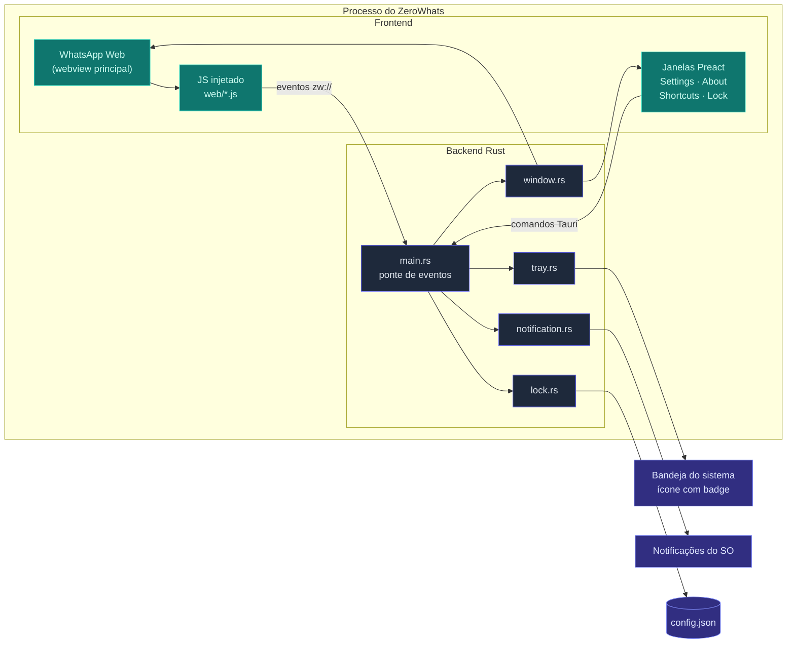
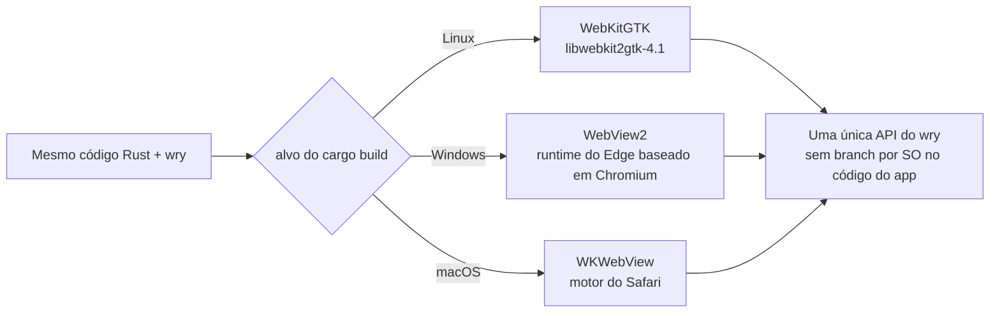
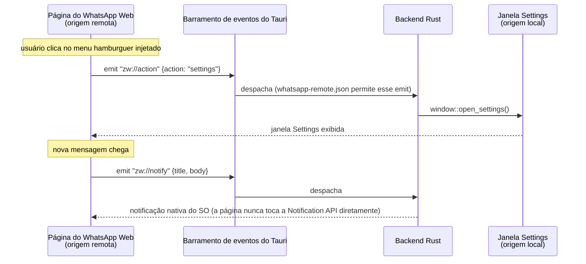
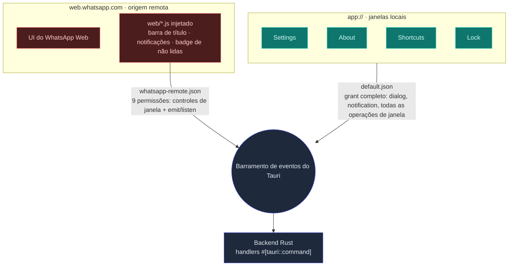

# Construindo o ZeroWhats: Rust, Tauri e o Argumento Contra Empacotar um Navegador

**Sem Electron. Sem navegador embutido. Sem telemetria.** O ZeroWhats é um cliente desktop de WhatsApp Web para Linux, macOS e Windows, construído com [Tauri](https://tauri.app) e [Preact](https://preactjs.com): notificações nativas do SO, bloqueio de app com auto-lock, contador de não lidas na bandeja, um sandbox de navegação exclusivo do WhatsApp, e um binário que sai na faixa de poucos megabytes em vez de algumas centenas.

<br />

Este post cobre a história técnica: por que o wry do Tauri venceu Servo, Gecko e Chromium-via-CEF para esse trabalho, o que a seleção "automática" de WebView realmente significa, como o modelo de segurança tem escopo definido capability por capability com o JSON de verdade, por que Preact e por que Rust, quanto isso custa em números reais dos artefatos de release, e onde a IA entrou (e onde não).

<br />

<ImageCarousel>
  
  
</ImageCarousel>

<nav className="article-toc" aria-label="Contents">

- [Construindo o ZeroWhats: Rust, Tauri e o Argumento Contra Empacotar um Navegador](#construindo-o-zerowhats-rust-tauri-e-o-argumento-contra-empacotar-um-navegador)
  - [Por Que Construir Mais Um Cliente de WhatsApp](#por-que-construir-mais-um-cliente-de-whatsapp)
  - [Arquitetura num Relance](#arquitetura-num-relance)
  - [A Aposta Central: Tauri, Wry e uma WebView Escolhida pelo SO](#a-aposta-central-tauri-wry-e-uma-webview-escolhida-pelo-so)
  - [Os Motores de WebView Que Eu Realmente Considerei](#os-motores-de-webview-que-eu-realmente-considerei)
    - [Servo, via Verso](#servo-via-verso)
    - [Gecko: Nenhuma Porta de Entrada](#gecko-nenhuma-porta-de-entrada)
    - [CEF: O Próprio Estudo de Caso do Karere](#cef-o-próprio-estudo-de-caso-do-karere)
  - [Por Que Não Karere, ZapZap, Ferdium ou Franz](#por-que-não-karere-zapzap-ferdium-ou-franz)
  - [Uma WebView, Não Duas](#uma-webview-não-duas)
    - [Uma Peculiaridade do WebKitGTK Escondida na User-Agent](#uma-peculiaridade-do-webkitgtk-escondida-na-user-agent)
    - [O Sandbox Não É Só um Slogan](#o-sandbox-não-é-só-um-slogan)
  - [A Ponte de Eventos zw://](#a-ponte-de-eventos-zw)
  - [O Modelo de Segurança, Com Honestidade](#o-modelo-de-segurança-com-honestidade)
  - [Por Que Preact para Quatro Janelas Pequenas](#por-que-preact-para-quatro-janelas-pequenas)
  - [Por Que Rust no Backend](#por-que-rust-no-backend)
  - [Quanto Isso Custa de Verdade](#quanto-isso-custa-de-verdade)
  - [Onde a IA Ajudou, e Onde Não Ajudou](#onde-a-ia-ajudou-e-onde-não-ajudou)
  - [Experimente](#experimente)

</nav>

## Por Que Construir Mais Um Cliente de WhatsApp

O WhatsApp Web já roda em qualquer aba do navegador. A lacuna é tudo aquilo que uma aba estruturalmente não consegue te dar: uma identidade de verdade no dock/barra de tarefas, notificações nativas do SO em vez das Web Notifications com permissão controlada pelo navegador, uma presença persistente na bandeja com contador de não lidas, atalhos de teclado globais, e uma tela de bloqueio que sobrevive a você se afastar da mesa. O app oficial de desktop fecha parte dessa lacuna, e um punhado de clientes da comunidade fecha o resto — Karere, ZapZap, a "receita" de WhatsApp dentro do Ferdium — cada um fazendo uma aposta diferente sobre como renderizar a página e quanto app construir ao redor dela.

A aposta do ZeroWhats é manter a superfície tão pequena quanto o problema permite: uma WebView, apontada para o WhatsApp e para mais nada, mais um punhado de janelas auxiliares pequenas para o que o próprio WhatsApp Web não oferece — configurações, um bloqueio de app, atalhos de teclado. Sem sistema de conta, sem telemetria, sem um segundo motor de renderização para manter atualizado. Tudo abaixo é o raciocínio por trás de cada pedaço dessa aposta, incluindo as partes que eu mudaria.

## Arquitetura num Relance

Uma janela sem bordas carrega `web.whatsapp.com` diretamente — sem modificação, é o próprio app web do WhatsApp, não uma reimplementação. Um conjunto de pequenos arquivos JavaScript é injetado nessa página para adicionar uma barra de título embutida, fazer a ponte das notificações nativas, e reportar o contador de não lidas de volta para o Rust. Todo o resto — Settings, About, Shortcuts, a tela de Lock — é uma janela Preact pequena e separada, sem bordas, conversando com o mesmo backend Rust por meio de comandos Tauri tipados.



O backend são nove módulos Rust focados (`window`, `lock`, `notification`, `tray`, `commands`, `config`, `password`, `clipboard`, `scripts`) mais os scripts `web/*.js` que eles injetam — sem monólito, sem um god-object mutável compartilhado. O `main.rs` é só a fiação entre eles.

## A Aposta Central: Tauri, Wry e uma WebView Escolhida pelo SO

O Tauri não embute um motor de navegador. Ele embute o [wry](https://github.com/tauri-apps/wry), um crate Rust que se liga ao motor que o SO alvo já tem: `webkit2gtk` no Linux, o loader do WebView2 (baseado em Chromium, parte do Windows moderno) no Windows, a ponte Objective-C do `WKWebView` no macOS, e a WebView da plataforma no Android para alvos mobile.

"Automático" não significa que o app sonda o melhor motor em tempo de execução e escolhe um — significa que eu nunca escrevo esse branch. A mesma chamada a `tauri::WebviewWindowBuilder` em `window.rs` compila para três motores de renderização diferentes dependendo de qual alvo você compila, atrás de uma única API Rust:



Essa única decisão é de onde vem a maior parte do resto deste artigo. Não empacotar um motor significa não empacotar o Chromium, o que significa que o binário fica na casa de poucos megabytes em vez de algumas centenas — e significa que os patches de segurança do motor de navegador em si andam no canal de atualização do próprio SO, em vez do meu pipeline de release. Também significa aceitar tudo que esse motor fornecido pelo SO consegue e não consegue fazer, o que é um custo real, não um almoço grátis — os ajustes específicos de WebKitGTK mais adiante neste post são exatamente essa conta chegando.

O Tauri até permite trocar toda a camada de runtime — é o que o `tauri-runtime-verso` faz para o Servo, logo abaixo — mas isso é um compromisso fundamentalmente maior do que uma flag de configuração. Você está substituindo toda a infraestrutura de janelas e IPC do wry, não escolhendo um motor dentro dele.

## Os Motores de WebView Que Eu Realmente Considerei

Antes de me decidir por "deixar o wry escolher", eu olhei para as outras formas de colocar um motor web dentro de um app desktop em Rust.

| Motor / caminho de entrada                                      | Modelo de integração                                                                      | Onde estava quando decidi                                                                                                                                                                          | Veredito                                                                                                                                                              |
| --------------------------------------------------------------- | ----------------------------------------------------------------------------------------- | -------------------------------------------------------------------------------------------------------------------------------------------------------------------------------------------------- | --------------------------------------------------------------------------------------------------------------------------------------------------------------------- |
| **WebView do sistema via wry** (WebKitGTK, WebView2, WKWebView) | Runtime padrão do Tauri (`tauri-runtime-wry`)                                             | Nível de produção — todo app Tauri 1.x/2.x em uso hoje roda isso                                                                                                                                   | **Escolhido**                                                                                                                                                         |
| **Servo, via Verso**                                            | Um runtime customizado separado do Tauri, `tauri-runtime-verso` — não é um backend do wry | Experimental, financiado por uma grant da NLnet; no momento da integração cobria só um subconjunto dos recursos de janela do Tauri — sem decorações, sem transparência, sem menus por janela ainda | Ainda não — o ZeroWhats precisa de uma janela transparente, sem bordas e guiada pela bandeja hoje                                                                     |
| **Gecko** (motor do Firefox)                                    | Nenhuma API de embedding de terceiros mantida                                             | A Mozilla abandonou o embedding genérico do Gecko por volta de 2011; o GeckoView é o único caminho de embedding mantido, e é exclusivo do Android                                                  | Descartado — não existe porta de entrada suportada                                                                                                                    |
| **CEF** (Chromium Embedded Framework)                           | Runtime próprio; substitui o wry por completo — janelas e IPC próprios                    | Maduro e comprovado — o próprio Karere migrou para ele na reescrita 4.0                                                                                                                            | Rejeitado — empacota um build privado de Chromium por SO/arquitetura, no meu próprio ritmo de patch, exatamente o custo que uma WebView de sistema existe para evitar |
| **Chromium embutido via Electron**                              | Um framework diferente, não uma escolha de WebView                                        | Maduro, totalmente consistente entre SOs                                                                                                                                                           | Rejeitado — mesmo custo de navegador embutido do CEF, mais um runtime Node.js empacotado em cima                                                                      |

### Servo, via Verso

Essa é a opção que eu realmente gostaria de revisitar. O [Verso](https://github.com/versotile-org/tauri-runtime-verso) embute o [Servo](https://servo.org/) — o motor de navegador em Rust — como um runtime alternativo do Tauri, e o time do Tauri vem mantendo isso como um experimento oficial, financiado por uma grant da NLnet, com o objetivo específico de dar ao Tauri um motor memory-safe sem nenhum C++ dentro. Isso é, ideologicamente, o que mais se aproxima do que um framework desktop Rust-first "deveria" rodar.

Só que ainda não chegou lá para este app. No momento em que avaliei, o `tauri-runtime-verso` suportava um subconjunto do que o `tauri-runtime-wry` suporta — sem decorações de janela, sem transparência, sem menus por janela além de um menu único no macOS — e a janela principal do ZeroWhats é sem bordas, transparente e com cantos arredondados via CSS desde o primeiro dia. O próprio roadmap do time do Tauri fala de um Verso "evergreen" compartilhado, distribuído e auto-atualizado do jeito que o WebView2 é no Windows, o que removeria a pergunta "quem faz patch dessa coisa do tamanho do Chromium" que descarta o CEF logo abaixo. Se isso vingar, é a coisa mais provável de eventualmente substituir o wry aqui. Hoje, significaria entregar uma janela pior por uma história melhor.

### Gecko: Nenhuma Porta de Entrada

O Gecko nem chegou a uma avaliação de verdade, porque não havia nada para avaliar. A Mozilla matou o embedding genérico do Gecko por volta de 2011 — a API existia para coisas como o antigo navegador Galeon, e o próprio dono do módulo de embedding da Mozilla citou a complexidade da mudança para o Firefox multi-processo e uma decisão deliberada de priorizar o Firefox em si em vez de dar suporte a quem embute o motor por fora. O que sobrou é pouco documentado e não é mantido de forma significativa; a única superfície de embedding ativamente mantida, o GeckoView, é exclusiva do Android. Não existe um equivalente do WebView2 ou do WebKitGTK para o Gecko no desktop. É uma lacuna real e conhecida do ecossistema, não um descuido meu.

### CEF: O Próprio Estudo de Caso do Karere

O CEF é a alternativa mais defensável dessa lista, e eu não preciso especular sobre quanto escolhê-lo teria custado — o [Karere](https://github.com/tobagin/karere), um cliente de WhatsApp em GTK4/Libadwaita para Linux, rodou o experimento por mim. O Karere foi lançado em cima do WebKitGTK primeiro, depois reescreveu seu backend de renderização para CEF na versão 4.0 para conseguir reprodução completa de anexos de vídeo e sessões multi-conta isoladas — capacidades reais que o WebKitGTK dificultava. É uma troca legítima, e ela trouxe algo genuíno para o Karere.

É também exatamente o custo que uma abordagem de WebView de sistema existe para evitar: CEF significa embutir um build privado de Chromium, um por SO e arquitetura, com patch no seu próprio cronograma em vez do cronograma do SO. Ele não se encaixa no wry — adotá-lo é uma substituição de runtime, não uma mudança de configuração — e reintroduz o problema "agora você é dono do ritmo de patch de segurança do Chromium" que não empacotar um navegador deveria resolver, para começo de conversa. Para um app de propósito único cujo argumento principal é "pequeno, sandboxed, e vive no próprio ciclo de patch do SO", essa troca não passou no crivo.

## Por Que Não Karere, ZapZap, Ferdium ou Franz

A questão do motor é uma camada. A outra é: vários desses já existem como apps prontos — por que o ZeroWhats é um uso defensável do tempo de alguém, inclusive o meu?

| Cliente                                    | Shell / linguagem             | Motor de renderização                                 | Escopo                                                       | Formato do consumo                               |
| ------------------------------------------ | ----------------------------- | ----------------------------------------------------- | ------------------------------------------------------------ | ------------------------------------------------ |
| **ZeroWhats**                              | Rust (Tauri 2) + Preact       | WebView do sistema (WebKitGTK / WebView2 / WKWebView) | Só WhatsApp, navegação em sandbox                            | Pacote nativo de ~2–4 MB; sem navegador embutido |
| **Karere** (≥4.0)                          | Shell nativo GTK4/Libadwaita  | CEF — Chromium embutido (saiu do WebKitGTK na 4.0)    | Só WhatsApp, multi-conta                                     | Empacota um runtime privado de Chromium          |
| **ZapZap**                                 | Python + PyQt6                | QtWebEngine — Chromium embutido                       | Só WhatsApp                                                  | Chromium embutido mais o runtime Python/Qt       |
| **Ferdium** (fork do Ferdi, fork do Franz) | Electron (Node.js)            | Chromium embutido                                     | Dezenas de serviços de chat — WhatsApp é só mais uma receita | Consumo pleno de Electron, por design            |
| **WhatsApp Desktop** (oficial)             | Electron, confirmado no macOS | Chromium embutido                                     | Só WhatsApp, oficial                                         | Consumo de Electron                              |

Nada disso é uma crítica aos outros — é uma aposta diferente. A razão de existir do Ferdium é abrangência: se você já roda Slack, Discord e mais quatro serviços por um agregador só, o custo do Electron é diluído entre todos eles, e o WhatsApp é só mais uma receita num app maior; é uma troca justa para o que o Ferdium tenta ser, e sua linhagem Franz/Ferdi é especificamente sobre fazer isso sem um nível de conta pago ou telemetria — uma linhagem que merece respeito. A reescrita do Karere para CEF comprou isolamento multi-conta e compatibilidade completa de codecs de mídia, aceitando o custo do Chromium embutido que o ZeroWhats foi construído especificamente para evitar. O ZapZap ganha a mesma compatibilidade em nível de Chromium através do WebEngine do Qt, mais um runtime Python em cima.

O ZeroWhats tenta ser uma coisa só: uma única janela de WhatsApp, sandboxed para o WhatsApp e nada além disso, com a menor superfície de ataque e a menor dependência que eu conseguisse alcançar, usando um motor que o SO já entrega e já corrige. Isso significa abrir mão de suporte multi-conta e da compatibilidade de mídia em nível de CEF. Em troca, você tem um cliente cujo grant de capability inteiro voltado para fora é nove permissões em um único arquivo JSON auditável (abaixo), e um binário pequeno o bastante, e um código simples o bastante, para ler por completo numa tarde.

## Uma WebView, Não Duas

O WhatsApp Web é a única coisa renderizada por um motor de navegador na janela principal — a barra de título customizada não é uma segunda WebView empilhada em cima dela. É DOM injetado na mesma página, estilizado para parecer chrome do app. O raciocínio é direto, direto do código: uma segunda WebView empilhada quebra o tratamento de input no Linux, então existe exatamente uma WebView por janela, ponto final.

A janela em si é sem bordas e transparente, com cantos arredondados pintados por CSS em vez de decorações do gerenciador de janelas, o que esbarra numa peculiaridade real dos compositores Wayland: uma janela transparente e arredondada mostrada antes do primeiro frame composto ser pintado pode ficar presa renderizando opaca, porque o visual alfa só é reconhecido quando um frame realmente chega. A correção é sem graça — a janela é sempre criada oculta, e o `rounded-corners.js` injetado a revela no próximo frame, quando a folha de estilo de arredondamento já está em vigor (ou a tela de Lock a revela mais tarde, se uma senha estiver definida). É um detalhe pequeno, mas é a diferença entre "parece polido" e "pisca branco ao abrir" numa boa fatia dos desktops Linux.

### Uma Peculiaridade do WebKitGTK Escondida na User-Agent

Aqui vai um exemplo concreto do que "a WebView do sistema" custa na prática, e como o ZeroWhats paga essa conta. O WhatsApp Web serve código diferente para motores de navegador diferentes, o que faz sentido, já que Chrome/Blink e Safari/WebKit não renderizam de forma idêntica. O movimento óbvio seria fingir um user-agent de Chrome para o WhatsApp servir o caminho mais testado. O ZeroWhats faz o oposto — ele anuncia, por padrão, um user-agent genuíno de Safari no macOS:

```rust
// Safari no macOS. Como o motor de execução *é* o WebKit, anunciar um
// navegador WebKit de verdade faz o WhatsApp Web servir o caminho de
// código Safari/WebKit — o único contra o qual ele de fato testa para
// WebKit — o que corrige a renderização de figurinhas (WebP animado)
// e emojis que quebrava sob o disfarce de Chrome acima.
"Mozilla/5.0 (Macintosh; Intel Mac OS X 10_15_7) AppleWebKit/605.1.15 ..."
```

O motor de execução que de fato renderiza a página é o WebKit. Fingir ser Chrome ativa o caminho de código Blink do WhatsApp, que o WebKitGTK então renderiza de forma imperfeita — figurinhas animadas e alguns emojis quebram. Contar a verdade sobre o motor ativa o caminho Safari/WebKit testado pelo WhatsApp, e eles renderizam corretamente. É uma pequena inversão: mentir menos, não mais, corrige o bug, e só funciona porque o app é honesto consigo mesmo sobre qual motor está de fato rodando. (Um UA mobile mais leve e o antigo disfarce de Chrome continuam disponíveis atrás das variáveis de ambiente `ZW_LIGHT_UA`/`ZW_CHROME_UA`, mantidas para testar A/B de renderização e consumo de memória, não para uso em produção.)

### O Sandbox Não É Só um Slogan

"Sandbox exclusivo do WhatsApp" é um bullet point do README, e também são três linhas de código. Todo evento de navegação dentro da janela principal é checado contra uma allow-list antes de ser permitido; qualquer coisa que não seja `web.whatsapp.com`, um host `*.whatsapp.com`/`*.whatsapp.net` (o WhatsApp serve mídia pelos próprios subdomínios de CDN), ou uma URL `about:`/`blob:`/`data:` dentro da página, é rejeitada de cara e entregue ao navegador padrão do SO:

```rust
fn allow_navigation(app: &AppHandle, url: &Url) -> bool {
    if is_whatsapp_url(url) {
        return true;
    }
    if matches!(url.scheme(), "http" | "https") {
        commands::open_external(app, url.as_str());
    }
    false
}
```

Um link compartilhado, um anúncio de golpe dentro de um grupo, um redirecionamento de phishing — nada disso consegue renderizar dentro do processo do próprio app. Abre no navegador que você teria clicado de qualquer forma, com todas as proteções que esse navegador já tem.

## A Ponte de Eventos zw://

A barra de título vive dentro de `web.whatsapp.com` — uma origem remota. O modelo de segurança do Tauri traça uma linha dura ali: uma página remota pode chamar os comandos **core** embutidos do Tauri se uma capability conceder isso, mas ela nunca pode chamar os próprios comandos `#[tauri::command]` do ZeroWhats — esses só são alcançáveis a partir das janelas locais do app. Isso não é uma gambiarra para contornar; é o comportamento correto para uma página cujo JavaScript você não controla.

Então os scripts injetados não chamam nada. Eles emitem eventos — `zw://action`, `zw://unread`, `zw://notify`, `zw://open-external` — e o `main.rs` escuta exatamente esses nomes e despacha para a lógica de backend de verdade:



A página remota pode gritar dentro de uma caixa de correio; ela não consegue atender o telefone. Essa superfície fixa de eventos nomeados também é a história de segurança inteira numa frase: não é "a página remota pode disparar qualquer comportamento de backend", é "a página remota pode emitir um entre quatro sinais específicos, inofensivos por construção, e só o Rust decide o que acontece depois."

## O Modelo de Segurança, Com Honestidade

O escopo por capability é onde o sistema de permissões do Tauri 2 mostra seu valor, e vale mais mostrar os arquivos de verdade do que descrevê-los. O grant de cada janela vive em `src-tauri/capabilities/`, dividido em dois.

A capability padrão — tudo que as janelas locais `app://` recebem:

```json
{
  "identifier": "default",
  "windows": ["main", "settings", "about", "shortcuts", "lock"],
  "permissions": [
    "core:default",
    "core:app:allow-version",
    "core:event:allow-emit",
    "core:event:allow-listen",
    "core:event:allow-unlisten",
    "core:window:allow-start-dragging",
    "core:window:allow-close",
    "core:window:allow-hide",
    "core:window:allow-show",
    "core:window:allow-minimize",
    "core:window:allow-unminimize",
    "core:window:allow-set-fullscreen",
    "core:window:allow-set-focus",
    "core:window:allow-is-visible",
    "dialog:default",
    "notification:default"
  ]
}
```

E o grant para a única origem remota permitida em qualquer lugar do app:

```json
{
  "identifier": "whatsapp-remote",
  "windows": ["main"],
  "remote": { "urls": ["https://web.whatsapp.com", "https://*.whatsapp.com"] },
  "permissions": [
    "core:window:allow-start-dragging",
    "core:window:allow-start-resize-dragging",
    "core:window:allow-minimize",
    "core:window:allow-close",
    "core:window:allow-toggle-maximize",
    "core:window:allow-is-maximized",
    "core:window:allow-set-fullscreen",
    "core:event:allow-emit",
    "core:event:allow-listen"
  ]
}
```

Nove permissões — controles de chrome de janela mais emit/listen. Sem dialog, sem notification, sem sistema de arquivos, nada que toque a senha ou o arquivo de configuração. Essa é a superfície inteira alcançável a partir de `web.whatsapp.com`, em um arquivo que você lê em trinta segundos. O Tauri só aplica um grant `remote` a uma capability que declara um explicitamente, e o `default.json` deliberadamente não declara — então nada do seu grant mais amplo vaza para a origem do WhatsApp por acidente.



O conteúdo local também roda sob um CSP estrito (`app.security.csp` em `tauri.conf.json`):

```
default-src 'self'; img-src 'self' asset: data: https://asset.localhost; style-src 'self' 'unsafe-inline'; font-src 'self' data:; connect-src 'self' ipc: http://ipc.localhost; script-src 'self'
```

O bloqueio de app segue o mesmo instinto de "dizer exatamente o que faz e o que não faz". A senha é hasheada com Argon2id, e só o hash é armazenado, no `config.json`, no diretório padrão de configuração de app do SO — nunca a senha em si. Esquecê-la significa se reautenticar como administrador do sistema: `pkexec` no Linux, um prompt de admin via AppleScript no macOS, um processo PowerShell elevado por UAC no Windows — uma checagem de credencial real do SO, não uma checagem no nível do app:

```rust
#[cfg(target_os = "linux")]
pub fn reset_with_admin() -> bool {
    std::process::Command::new("pkexec")
        .arg("/bin/true")
        .status()
        .map(|status| status.success())
        .unwrap_or(false)
}
```

E então a parte honesta, copiada direto do `SECURITY.md` porque suavizar isso derrubaria o objetivo: o ZeroWhats é pré-1.0 e não auditado. O unlock não tem nenhum rate-limit contra força bruta — ele checa o hash Argon2id sem limite de tentativas, então o bloqueio desencoraja acesso casual a uma máquina desacompanhada, não um atacante determinado com uma imagem de disco. O `config.json` é um arquivo comum, não o keyring/Secret Service do SO, então qualquer um com acesso de leitura a ele pode atacar o hash offline. Releases não são assinadas por padrão — a assinatura de código é opt-in na CI, condicionada aos certificados do mantenedor — então espere avisos do Gatekeeper/SmartScreen até isso ser configurado. Nada disso está escondido em letra miúda; está no topo da política de segurança, porque um modelo de ameaça que você não declara é um modelo de ameaça sobre o qual você está mentindo silenciosamente.

## Por Que Preact para Quatro Janelas Pequenas

A própria UI do WhatsApp não precisa de nenhum framework de frontend do ZeroWhats — a janela principal só carrega `web.whatsapp.com` e recebe o próprio app do WhatsApp, sem modificação. O único código de UI que o ZeroWhats entrega é para Settings, About, Shortcuts e a tela de Lock: quatro janelas pequenas e independentes, cada uma sua própria instância de WebView com seu próprio bundle JS para carregar.

Essa última parte é o motivo de ser Preact especificamente, não React. Uma diferença de tamanho de bundle que é um erro de arredondamento numa SPA típica se multiplica por cada janela que a carrega separadamente, e essas são janelas que precisam abrir instantaneamente a partir de um clique na bandeja ou de um bloqueio por inatividade, não esquentar um router e uma história de gerenciamento de estado. A API do Preact é próxima o bastante da do React que `@preact/preset-vite` mais alguns shims de `@types/react` tornaram a portabilidade praticamente gratuita, por uma fração do payload. Para quatro janelas pequenas, abertas com frequência, leves em termos de framework, ao lado de uma filosofia de projeto de "binário pequeno, tudo pequeno", trazer o React completo teria sido a escolha estranha, não o Preact.

## Por Que Rust no Backend

Três necessidades separadas apontaram para Rust, não só uma.

A primeira é o próprio Tauri: o wry, o ecossistema de plugins (`tauri-plugin-autostart`, `-window-state`, `-single-instance`, `-notification`, `-dialog`, `-log`, `-opener`), e todo o modelo de "shell fino em volta de uma WebView de sistema" são nativos de Rust. Construir sobre o Tauri sem escrever Rust não é bem uma opção.

A segunda é o alcance em nível de sistema que o app realmente precisa: disparar `pkexec`/`osascript`/um processo PowerShell elevado para o fluxo de reset por admin; ler os bytes brutos de imagem da área de transferência do SO através do `arboard`, uma lacuna que o próprio WebKitGTK não consegue fechar (a página não consegue pegar dados de imagem direto da área de transferência do sistema — [WebKit bug #218519](https://bugs.webkit.org/show_bug.cgi?id=218519) — então o lado Rust lê e reconverte para uma data URL para a página); e alcançar além da própria superfície de API do Tauri, direto no crate `webkit2gtk`, para ligar a verificação ortográfica do enchant e seus dicionários, já que nenhuma API do Tauri expõe isso. Esse é o tipo de trabalho de FFI e API de sistema que o ecossistema de crates do Rust torna viável sem escrever bindings C unsafe à mão.

A terceira é o próprio orçamento de tamanho. O perfil de release é ajustado, não deixado no padrão:

```toml
[profile.release]
opt-level = "s"
lto = true
codegen-units = 1
panic = "abort"
strip = true
```

`opt-level = "s"` otimiza para tamanho sem o custo de runtime do `"z"`; LTO mais uma única codegen unit deixa o compilador fazer inlining e eliminação de código morto através de todo o grafo de dependências em vez de crate por crate, ao custo de builds mais lentos; `panic = "abort"` derruba as tabelas de unwinding que um binário `panic = "unwind"` carrega para uma segurança de exceção que este app não precisa; `strip = true` remove os símbolos de debug do binário entregue. Nenhuma dessas alavancas existe para um runtime JavaScript — elas só existem porque o backend compila para código nativo, para começo de conversa.

## Quanto Isso Custa de Verdade

Números batem adjetivos, então aqui estão os reais — os artefatos de verdade publicados para a release v1.4.0:

| Pacote              | Plataforma | Tamanho | Por quê                                                          |
| ------------------- | ---------- | ------- | ---------------------------------------------------------------- |
| `.deb` (amd64)      | Linux      | ~3,5 MB | WebKitGTK é uma dependência de sistema declarada, não empacotada |
| `.rpm` (x86_64)     | Linux      | ~3,5 MB | O mesmo                                                          |
| `.msi`              | Windows    | ~2,5 MB | O WebView2 vem com o SO                                          |
| `-setup.exe`        | Windows    | ~1,8 MB | O mesmo                                                          |
| `.dmg`              | macOS      | ~2,8 MB | O WKWebView vem com o SO                                         |
| `.AppImage` (amd64) | Linux      | ~81 MB  | Empacota GTK/WebKitGTK para portabilidade entre distros          |
| `.snap` (amd64)     | Linux      | ~131 MB | Empacota seus próprios snaps de conteúdo/runtime                 |

A variação dentro dessa tabela é a arquitetura inteira em miniatura. Os pacotes que se apoiam numa WebView que o SO já entrega ficam na casa de poucos megabytes; os dois formatos que trocam essa suposição por portabilidade — empacotando o suficiente da stack GTK/WebKit para rodar, sem modificação, em qualquer distro — incham por algo entre 25 e 35×. Isso não é ineficiência; é o preço literal do que estão te vendendo.

Para comparação, um app Electron nu, sem nenhum recurso, é comumente medido em torno de 150–200 MB instalado antes de uma única dependência de aplicação, porque ele sempre empacota um Chromium completo e um runtime Node.js, sem nenhuma saída de emergência para a WebView do SO. Isso coloca ele na ordem de grandeza do formato mais empacotado do ZeroWhats (o Snap) e cerca de 40–90× seus pacotes nativos de Linux, seu instalador de Windows, ou sua imagem de disco de macOS.

Eu ainda não publiquei um benchmark formal de RAM em idle — isso é uma lacuna honesta, não modéstia, e um número preciso seria meio enganoso de qualquer forma: o custo de memória do ZeroWhats é quase inteiramente do processo do motor que está renderizando `web.whatsapp.com`, o mesmo custo de WebKitGTK/WebView2/WKWebView que você pagaria com essa página aberta numa aba de navegador comum, porque o WhatsApp Web é uma SPA React genuinamente pesada, não importa quem está hospedando ela. O backend Rust ao lado é um supervisor fino, quase sempre ocioso — sem loops de polling, sem trabalho de fundo persistente além da bandeja e do timer opcional de auto-lock por inatividade. Existe uma variável de ambiente `ZW_MINIMAL`, usada durante o desenvolvimento, que desliga especificamente os scripts de background-sync/notificações/badge para isolar esse custo de backend para medição — o começo de um benchmark de verdade, não um benchmark pronto.

## Onde a IA Ajudou, e Onde Não Ajudou

Uma pergunta justa para qualquer coisa construída em 2026: onde a IA realmente entrou no ZeroWhats?

Como uma caixa de ressonância, não como autora. Eu usei para argumentar trade-offs em voz alta antes de me comprometer com eles — a comparação de motores de WebView acima, o formato da divisão de capability entre `default.json` e `whatsapp-remote.json`, se uma ponte de eventos ou uma superfície de comandos expostos mais estreita era a resposta certa para "uma origem remota precisa disparar algum comportamento de backend". Eu usei para acelerar sessões de debug — do tipo em que você está olhando para uma diferença de renderização entre dois user-agents, ou um download em blob que silenciosamente nunca chega na própria maquinaria de download do WebKitGTK, e você quer uma segunda opinião sobre por onde nem começar a procurar antes de sair fazendo printf-debugging num motor de navegador. E, para este artigo especificamente, eu usei para checar minhas afirmações sobre projetos de outras pessoas — a migração do Karere para CEF, a cobertura de recursos atual do Verso, o que de fato aconteceu com a API de embedding do Gecko — contra a documentação atual, porque errar isso publicamente seria pior do que não escrever nada.

O que ela não fez: decidir que uma WebView é melhor que duas, escrever o JSON de capability e realmente sustentar essa decisão, escolher Argon2id e guardar só o hash, fazer à mão o renderizador de badge da bandeja em vez de trazer um crate de imagem para uma fonte de 16 pixels, ou escolher Tauri em vez de Electron logo no início. Essas decisões — e o código e os trade-offs por trás de cada uma delas neste artigo — são minhas, revisadas e entendidas por mim antes de irem para produção, não geradas e aceitas sem mais. IA é uma colaboradora rápida e ocasionalmente errada que eu mantenho com uma coleira curta. Ela não está no log de commits, e não é coautora.

## Experimente

O ZeroWhats é licenciado sob MIT e está no GitHub. Pegue um instalador na [última release](https://github.com/ZauJulio/ZeroWhats/releases) — `.AppImage`/`.deb`/`.rpm` para Linux, `.msi`/`.exe` para Windows, `.dmg` para macOS — ou leia o código-fonte, inteiro, numa tarde.

```bash
git clone https://github.com/ZauJulio/ZeroWhats.git
cd ZeroWhats
bun install
bun run tauri dev
```

Se você encontrar uma peculiaridade do WebKitGTK que eu ainda não contornei, ou uma capability com escopo mais largo do que precisaria, essa é exatamente o tipo de issue e PR que eu quero receber.

<br />

---

<br />

> O ZeroWhats não é afiliado ao WhatsApp ou à Meta — é um cliente, não um fork. Se o modelo de sandboxing ou a abordagem de escopo por capability daqui forem úteis para o seu próprio app Tauri, pegue emprestado; o código está bem ali.
