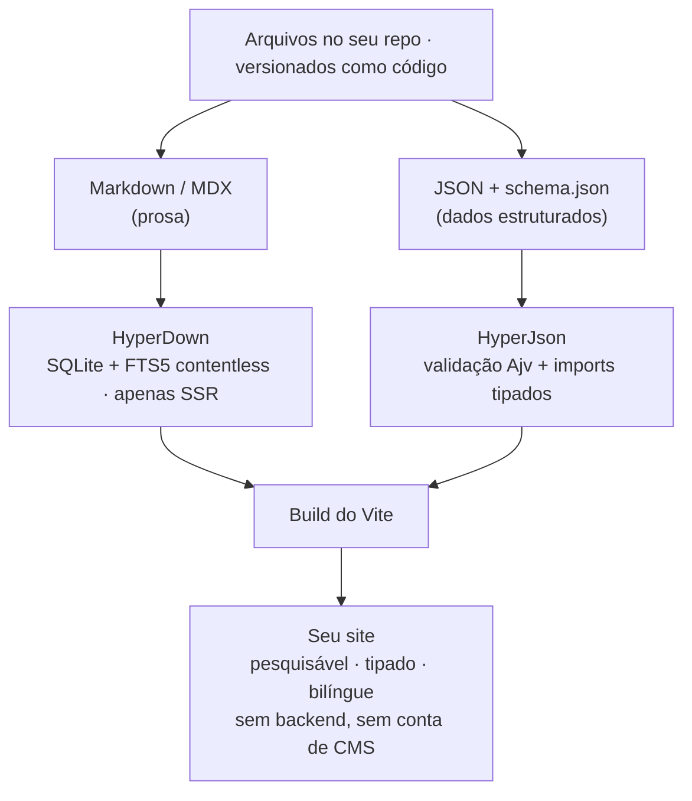
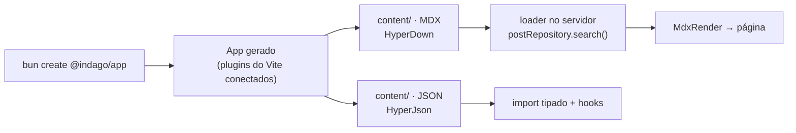
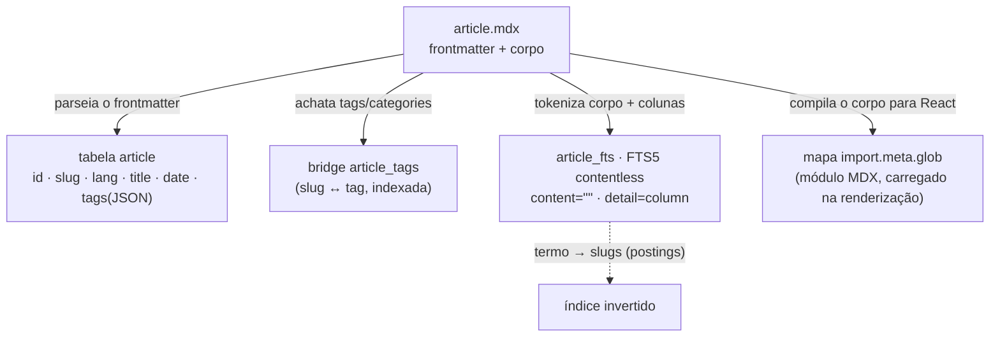
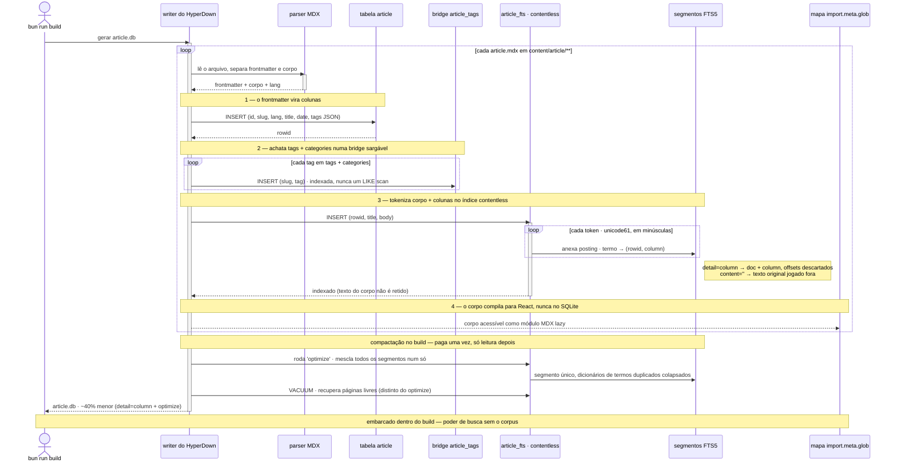
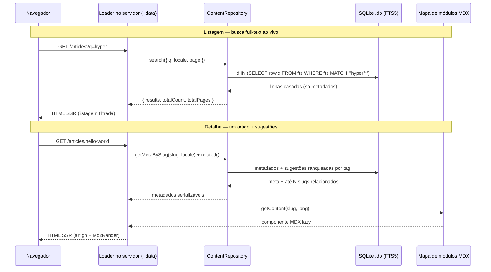
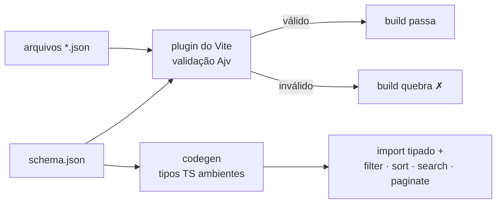

import { ScaffoldBox } from "@/components/mdx/ScaffoldBox";

# Começando com o Indago

Este é o guia completo do **Indago** — tanto o _porquê_ quanto o _como_. No fim, você vai entender o
que é o toolkit, como cada um dos seus dois motores funciona por baixo dos panos, e como ir de um
único comando a uma camada de conteúdo tipada, pesquisável e sem backend. Use a barra lateral à
esquerda para pular entre as seções; o mergulho no modelo de armazenamento do HyperDown é o coração
de tudo.

## O que é o Indago? #[start/#a855f7]

A maioria dos setups de "headless CMS" pede sempre as mesmas três coisas: rodar um serviço, pagar por
ele e ir até a rede a cada requisição. O Indago faz a aposta oposta — **fazer tudo em tempo de
build**. Seu conteúdo é só arquivos no seu repositório. Um plugin do Vite os lê, valida e emite
artefatos que os seus loaders no servidor consultam localmente. Não há **banco de dados no cliente**
nem **API em runtime** para manter acordada.

O retorno é uma camada de conteúdo rápida, tipada de ponta a ponta, internacionalizada e
inteiramente sua — versionada no git, ao lado do seu código. O Indago entrega isso por meio de **dois
motores independentes** que dividem o trabalho pelo _formato_ do seu conteúdo:

- O **[HyperDown](https://www.npmjs.com/package/@indago/hyper-down)** cuida da **prosa** — artigos,
  docs, receitas: qualquer coisa com um corpo que você queira ler e pesquisar.
- O **[HyperJson](https://www.npmjs.com/package/@indago/hyper-json)** cuida dos **dados
  estruturados** — projetos, skills, playlists: qualquer coisa que seja uma lista de registros com
  formato fixo.

Eles não compartilham código nem dependem um do outro. A única coisa em comum é a pasta `content/` e
a convenção de subpastas por locale. Use um, o outro, ou os dois.



O diagrama se lê de cima para baixo: arquivos entram, um motor para cada, um build, um site sai. Tudo
abaixo é só uma expansão dessa única linha — primeiro o comando que conecta tudo, depois cada motor
em profundidade.

## Crie um projeto com um comando

Você não monta o Indago na mão. O scaffolder conecta os dois motores em um app pronto para rodar, com
os plugins do Vite registrados, um `hyperdown.config.json` no lugar e conteúdo de exemplo já
presente. Escolha o seu framework e copie o comando:

<ScaffoldBox projectName="my-app" />

Ele cria o projeto, instala as dependências e te deixa a um comando do servidor de dev. Todos os
templates trazem as mesmas rotas e pastas de conteúdo, então o resto deste guia vale para qualquer
framework escolhido.



Com o projeto no lugar, vamos abrir o motor que faz o trabalho pesado.

## @indago/HyperDown — prosa em SQLite pesquisável #[deep dive/#0ea5e9]

O HyperDown é o maior dos dois motores, e o mais interessante, porque resolve um problema que a
maioria dos sites estáticos silenciosamente abandona: **busca full-text de verdade sobre prosa, sem
backend**. Esta é a parte que vale entender a fundo, então vamos de _o que ele faz_ a _como ele
armazena as coisas_ e _o que acontece numa requisição_ antes de escrever uma linha de código do app.

### O que ele faz

Aponte o HyperDown para uma pasta de Markdown/MDX e, em tempo de build, ele escreve um banco
**SQLite** compacto. Esse banco guarda **apenas os metadados do front-matter** — título, tags, datas,
slug, locale. O corpo de cada arquivo nunca é armazenado; em vez disso, ele é tokenizado num índice
full-text e, para renderização, carregado sob demanda a partir de um mapa de módulos do Vite à parte.
Em tempo de requisição, um `ContentRepository` tipado consulta o banco no servidor — busca full-text,
filtros por facetas, ordenação, paginação, busca por slug e sugestões "relacionadas" ranqueadas por
tag — e o corpo MDX correspondente é resolvido e renderizado como um componente React.

### Como funciona: o índice invertido contentless

Aqui está o modelo de armazenamento, e o diagrama ao qual toda outra afirmação desta seção se refere:



Leia-o como quatro destinos para um único arquivo. O front-matter vira **colunas** numa tabela SQLite
comum. `tags` e `categories` são, adicionalmente, achatadas numa **bridge indexada** para que filtros
de tag e contagens de facetas sejam sargáveis (um join indexado, nunca um scan com `LIKE`). O corpo e
as colunas são **tokenizados numa tabela virtual FTS5**. E o corpo, à parte, é compilado num
componente React acessível por um mapa estático `import.meta.glob` — nunca pelo SQLite. Vamos pegar
as três ideias de armazenamento, uma a uma.

**O índice invertido.** Uma tabela comum responde "dada esta linha, quais são suas palavras?" Um
índice _invertido_ responde à pergunta que a busca de fato faz: "dada esta palavra, quais linhas a
contêm?" É a inversão clássica — em vez de `documento → termos`, ele guarda `termo → lista de
documentos` (a lista de cada termo é sua **postings list**). É isso que transforma "encontre todo
artigo que mencione `hyperdown`" numa busca de dicionário mais uma leitura de postings — `O(casos)` —
em vez de um scan completo sobre todos os corpos. O **FTS5** do SQLite te dá esse índice invertido de
graça, e o `ContentRepository` o usa como um filtro puro de pertinência:
`id IN (SELECT rowid FROM article_fts WHERE article_fts MATCH '"hyper"*')`.

**Contentless (`content=""`).** Por padrão, uma tabela FTS5 guarda uma cópia do texto original para
poder devolvê-lo. O HyperDown declara a tabela como **contentless** — `fts5(..., content="")` — o que
mantém o índice invertido mas **joga fora o texto original**. Você ainda pode buscar cada palavra; só
não consegue reconstruir o corpo _a partir do índice_. E você não precisa: o HyperDown já carrega o
corpo do mapa de módulos MDX em tempo de renderização. O resultado é um `.db` que carrega o poder de
busca de todo o corpus sem carregar o corpus, então ele fica pequeno o bastante para ir dentro do
build.

**O modo `detail` — `full` vs `column` vs `none`.** Dentro de um índice contentless ainda há uma
escolha sobre _quanta informação posicional_ cada ocorrência de token registra, e é a maior alavanca
sobre o tamanho do índice:

| `detail`         | guarda por token       | ainda suporta                           | tamanho do índice¹ |
| ---------------- | ---------------------- | --------------------------------------- | ------------------ |
| `full`           | doc + coluna + posição | tudo (frase, `NEAR`, `bm25` posicional) | **100%**           |
| `column` (nosso) | doc + coluna           | termo, prefixo, booleano, `column:term` | ~58%               |
| `none`           | só o doc               | termo, prefixo, booleano apenas         | ~46%               |

> ¹ Razões medidas no corpus de artigos deste projeto, pós-`optimize`. Os números absolutos variam
> com o conteúdo; a ordem se mantém.

O padrão, `detail=full`, registra _onde dentro da coluna_ cada token fica — as posições que viabilizam
busca por frase (`"getting started"` como sequência adjacente), `NEAR` e o ranking posicional do
`bm25`. O HyperDown não faz nada disso: ele só emite queries de prefixo + booleanas e nunca chama
`bm25()`. Então ele cai para **`detail="column"`**, que ainda registra _em qual coluna_ um token vive
— suficiente para suportar um futuro "buscar só nos títulos" (`title:term`) — mas descarta as
posições. Paramos de propósito em `column` em vez do ainda menor `none`: `none` proibiria queries
`column:term` para sempre sem uma migração de schema e um rebuild completo, então `column` é o
meio-termo frugal-mas-sem-se-encurralar. Trocar é uma mudança de uma linha no motor.

**`optimize` em tempo de build e segmentos.** Inserir as linhas uma a uma deixa o índice FTS
espalhado em vários **segmentos** no disco, cada um repetindo o próprio dicionário de termos — as
postings do mesmo termo acabam fragmentadas entre todos eles. Depois das inserções, o writer roda o
`'optimize'` do FTS5, que mescla todos os segmentos em um só e colapsa a sobrecarga duplicada. Isso é
**distinto do `VACUUM`**, que só recupera páginas livres do _arquivo_ e nunca toca nos segmentos do
FTS — então o writer roda os dois, em sequência. Como o `.db` é gerado uma vez no build e só leitura
depois, esse passo `O(tamanho do índice)` é pago uma única vez e todo visitante lê o resultado
compactado de graça. Juntos, `detail="column"` mais `optimize` cortam o índice em cerca de **40%**
frente ao padrão sem ajuste — uma mudança minúscula no motor, custo zero em runtime.

**O caminho de escrita, de ponta a ponta.** O mapa acima é um arquivo se ramificando em quatro
destinos; aqui está o mesmo modelo _em movimento_ — exatamente o que o writer de build faz, em ordem,
para transformar uma pasta de MDX no `.db` contentless e compactado que é embarcado. Veja o índice
invertido sendo construído uma posting por vez, o que `content=""` e `detail="column"` descartam na
inserção, e onde o `optimize` e o `VACUUM` entram no final:



As quatro notas numeradas batem uma a uma com as quatro setas do mapa de armazenamento: as colunas, a
bridge de tags, a inserção no FTS contentless e o módulo React. Os dois loops internos são a parte que
um diagrama estático não mostra — a bridge ganha uma linha indexada _por tag_, e o índice cresce uma
posting _por token_, que é exatamente onde `content=""` descarta o texto-fonte e `detail="column"`
descarta os offsets. Tudo depois do loop de arquivos é a compactação única que rende os ~40%.

### O ciclo de vida de uma requisição

O armazenamento é metade da história; a outra metade é o que acontece quando um visitante acessa uma
rota. Como o SQLite é consultado **apenas no servidor**, todo toque no banco vive num loader de rota.
Aqui está o caminho completo, tanto para uma busca na listagem quanto para uma página de detalhe:



Duas coisas para notar. Primeiro, os metadados e o corpo viajam por **caminhos separados** — o loader
recebe metadados serializáveis em JSON do SQLite, enquanto o corpo é resolvido do mapa de módulos no
componente. Essa separação é exatamente o que o índice contentless te compra. Segundo, o match do FTS
roda entre **todos os locales** e mapeia de volta para slugs, então "slow" e "lenta" trazem o mesmo
artigo; o filtro de `locale` então devolve uma linha por slug no idioma pedido.

### Como usar

Com o modelo claro, a API é pequena. Registre um tipo de conteúdo e crie um item com o CLI:

```bash
bunx @indago/hyper-down create-content --name post --folder Posts --fields "title:string:req,tags:tags:opt"
bunx @indago/hyper-down create-item --type post --slug hello-world --lang pt-BR
```

O codegen do build escreve um `postRepository` tipado e **exclusivo de servidor** na árvore
`.hyper-down/` do seu app. Importe-o **apenas de um loader** e rode uma busca:

```ts
import { postRepository } from "@hyper-down/content/post/builder";

export async function data() {
  const { results } = await postRepository.search({
    searchQuery: "olá", // FTS5 entre todos os locales
    locale: "pt-BR",
    pagination: { page: 1, pageSize: 10 },
  });

  return { results };
}
```

Depois, na view, resolva o módulo MDX e renderize com o `MdxRender`:

```tsx
import { MdxRender } from "@indago/hyper-down";

import { getPostContent } from "./data";

export function Post({ slug, locale }: { slug: string; locale: string }) {
  return <MdxRender content={getPostContent(slug, locale)} />;
}
```

Esse é o loop inteiro: defina um tipo, consulte-o no servidor, renderize o corpo no componente.

### Indexação composta & sidebars

Por padrão, uma coleção é indexada **por página** — o corpo inteiro vira um único documento
pesquisável. Habilite a indexação **composta** numa coleção e o HyperDown _também_ indexa cada seção
de título:

```jsonc
// hyperdown.config.json
{
  "database": {
    "indexByCollection": { "post": "composed" },
  },
}
```

Uma coleção composta ganha uma tabela `<type>_sections` com seu próprio índice FTS por seção, e uma
coluna `sections` que guarda a **árvore de títulos**. As buscas então linkam direto para `#âncoras`, e
o `meta.sections` de cada item alimenta o `<Sidebar/>` que já vem pronto — exatamente o que renderiza
a navegação à esquerda desta página. Os títulos podem até declarar uma pílula de sidebar inline com a
sintaxe de badge `#[label/#color]` (as pílulas ao lado dos títulos acima são precisamente isso).

## @indago/HyperJson — JSON Schema em conteúdo tipado

A prosa é só metade da maioria dos sites. A outra metade — sua lista de projetos, suas skills, uma
playlist — são **dados estruturados**, e forçá-los por um motor de Markdown seria a ferramenta
errada. É por isso que o HyperJson existe como um pacote separado e mais enxuto.

### O que ele faz

O HyperJson é **schema-first**. Você descreve um tipo de conteúdo uma vez como um `schema.json`; todo
arquivo JSON naquela pasta precisa satisfazê-lo. Em tempo de build, um plugin do Vite valida os
arquivos com o Ajv e um passo de codegen transforma o schema em **tipos TypeScript ambientes**. Não
há front-matter, não há SQLite e nada em tempo de requisição — é validação e geração de código puras,
em tempo de build.

### Como funciona



O diagrama captura o contrato inteiro, e ele se apoia em duas garantias. **Conteúdo inválido quebra o
build, não os seus usuários** — uma chave desconhecida (com `strict`) ou um tipo errado encerra o
build com código não-zero (com `failOnError`), então dados quebrados nunca chegam à produção. E
**conteúdo válido chega totalmente tipado** em cada import — sem interfaces escritas à mão para
dessincronizar dos dados.

### Como usar

Descreva um item como schema:

```json
{
  "$schema": "http://json-schema.org/draft-07/schema#",
  "type": "object",
  "additionalProperties": false,
  "required": ["name", "level"],
  "properties": {
    "name": { "type": "string" },
    "level": { "type": "integer", "minimum": 0, "maximum": 100 }
  }
}
```

Coloque arquivos de dados ao lado dele (pastas de locale funcionam igual ao HyperDown); cada um é
validado contra o schema acima. Um erro de digitação como `"level": "95"` ou uma propriedade
desconhecida é pego em tempo de build:

```json
{ "name": "TypeScript", "level": 95 }
```

Conecte o plugin ao Vite para que o build valide e gere os tipos:

```ts
import { hyperjsonValidationPlugin } from "@indago/hyper-json/plugins";

export default defineConfig({
  plugins: [hyperjsonValidationPlugin({ strict: true, failOnError: true })],
});
```

Depois, molde os dados já tipados com os hooks headless e em memória — **filter, sort, search,
paginate, compose** — sem banco de dados e sem async:

```ts
import { paginate, search, sortBy } from "@indago/hyper-json/hooks";

const matches = search(skills, "type", { fields: ["name"] });
const ranked = sortBy(matches, "level", "desc");
const page = paginate(ranked, { page: 1, pageSize: 10 });
```

## **HyperDown ou HyperJson?**

Este título está em **negrito**, então a barra lateral o mantém expandido — é a decisão que a maioria
dos leitores vem buscar. A regra de bolso segue o formato do seu conteúdo:

- **Use o HyperDown** quando seu conteúdo for **prosa** — artigos, docs, receitas — que precise de
  renderização Markdown/MDX e busca full-text com SQLite.
- **Use o HyperJson** quando seu conteúdo for **dados estruturados** com formato fixo — listas,
  registros, coleções tipo config — onde você quer validação e tipos, não um corpo para pesquisar.

Os dois motores são independentes, então isso nunca é exclusivo: a maioria dos sites reais (este
portfólio incluído) roda os dois lado a lado, prosa por um e dados estruturados pelo outro.

## Para onde ir agora

Agora você entende o Indago de ponta a ponta — a aposta no tempo de build, o índice contentless e o
ciclo de vida de requisição do HyperDown, e a validação schema-first do HyperJson. Para ver tudo
isso conectado num site real e em produção, leia
**[Construindo Este Portfólio](/pt/articles/building-this-portfolio)**, que usa os dois motores para
rodar um site totalmente pesquisável e bilíngue, sem backend. Para a API exaustiva, os READMEs dos
pacotes no npm (`@indago/hyper-down`, `@indago/hyper-json`) são a referência — e o jeito mais rápido
de sentir na prática ainda é `bun create @indago/app`.
